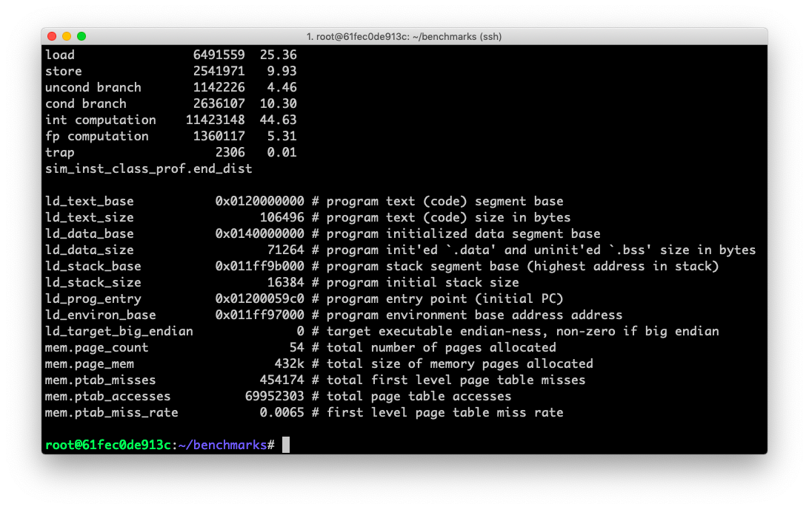

# Project 1 - Part 1

Zhicheng Zhang - G45149856


### 1. Introduction

Get Start with [SimpleScalar](http://www.simplescalar.com/).


### 2. Implementation

#### Prepare

##### Environment

- Docker image [krlmlr/debian-ssh](krlmlr/debian-ssh) on Debian 10 (host).
- File `~/simplesim-3v0e.tgz` is downloaded from http://www.simplescalar.com/.
- File `~/benchmarks.tar.gz` is downloaded from http://www.ecs.umass.edu/ece/koren/architecture/Simplescalar/benchmarks.tar.gz.

##### Script

``` bash
# install
apt-get install tar build-essential

# unzip
tar zxvf simplesim-3v0e.tgz
tar zxvf benchmarks.tar.gz

# path
PATH=$PATH:~/simplesim-3.0
```

#### Compile

``` bash
cd ~/simplesim-3.0
make clean
make config-alpha
make
make sim-tests
cd ~
```

#### Run

``` bash
cd ~/benchmarks
sim-profile -iclass anagram.alpha words < anagram.in > anagram.out
sim-profile -iclass go.alpha 50 9 2stone9.in > 2stone9.out
sim-profile -iclass compress95.alpha < compress95.in > compress95.out
sim-profile -iclass cc1.alpha -O 1stmt.i > 1stmt.s
cd ~
```


### 3. Result




### 4. Conclusion

| Benchmark      | Total # of Instructions | Load % | Store % | Uncond Branch % | Cond Branch % | Integer Computation % | Floating pt Computation % |
| -------------- | ----------------------- | ------ | ------- | --------------- | ------------- | --------------------- | ------------------------- |
| anagram.alpha  | 25597435                | 25.36  | 9.93    | 4.46            | 10.30         | 44.63                 | 5.31                      |
| go.alpha       | 545811809               | 30.62  | 8.17    | 2.58            | 10.96         | 47.64                 | 0.03                      |
| compress.alpha | 88001                   | 1.54   | 79.35   | 0.19            | 5.67          | 13.23                 | 0.00                      |
| gcc.alpha      | 337340977               | 24.67  | 11.47   | 4.12            | 13.33         | 46.30                 | 0.11                      |


### 5. Discussion

> 1. Is the benchmark memory intensive or computation intensive?

It seems that `compress.alpha` is memory intensive and others are computation intensive.

> 2. Is the benchmark mainly using integer or floating point computations?

These benchmark are mainly using integer computations.

> 3. What % of the instructions executed are conditional branches? Given this %, how many instructions on average does the processor execute between each pair of conditional branch instructions (do not include the conditional branch instructions)

See the table below:

| Benchmark      | Total # of Instructions | Cond Branch % | Total # of Cond Branch | Total # of Others | Average # between Cond Branch |
| -------------- | ----------------------- | ------------- | ---------------------- | ----------------- | ----------------------------- |
| anagram.alpha  | 25597435                | 10.30         | 2636107                | 22961328          | 8.71                          |
| go.alpha       | 545811809               | 10.96         | 59795799               | 486016010         | 8.13                          |
| compress.alpha | 88001                   | 5.67          | 4993                   | 83008             | 16.63                         |
| gcc.alpha      | 337340977               | 13.33         | 44969464               | 292371513         | 6.50                          |
