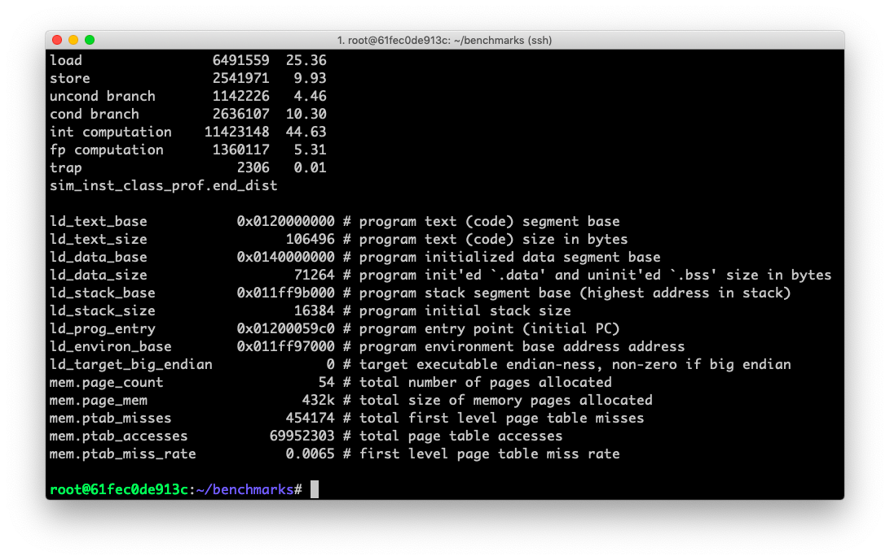
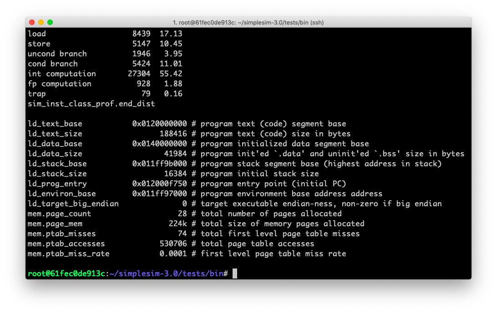
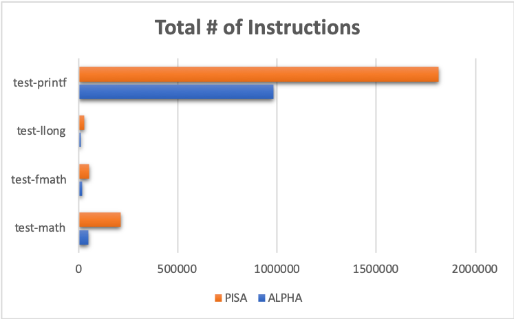
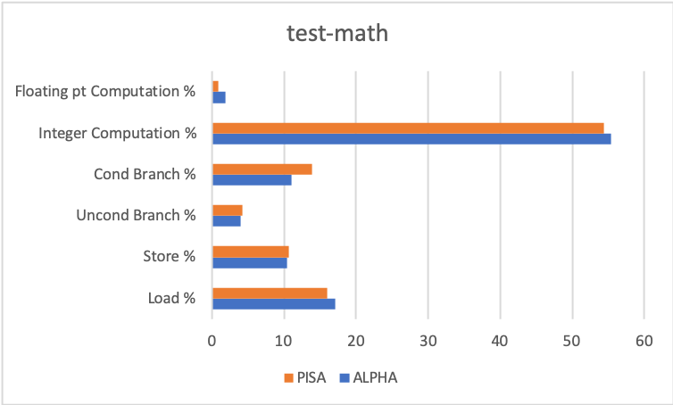
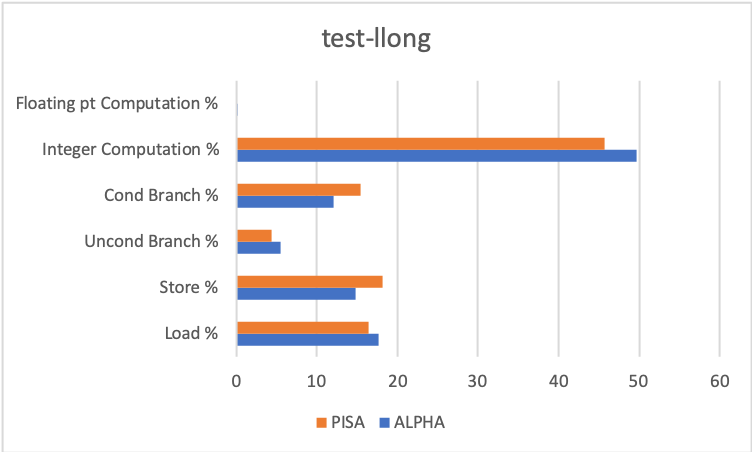
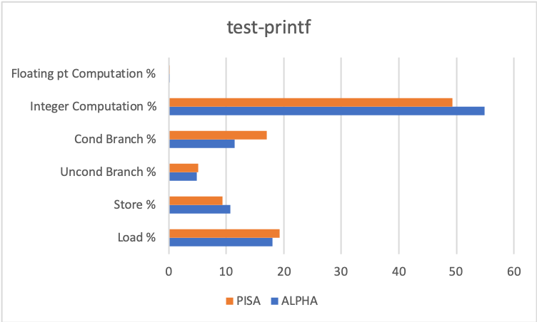

# Project 1 - Part 2

Zhicheng Zhang - G45149856


###1. Introduction

Compare the PISA and Alpha ISA by executing the same benchmarks on the two configurations.


### 2. Implementation

#### Prepare

##### Environment

- Docker image [krlmlr/debian-ssh](krlmlr/debian-ssh) on Debian 10 (host).
- File `~/simplesim-3v0e.tgz` is downloaded from http://www.simplescalar.com/.
- File `~/benchmarks.tar.gz` is downloaded from http://www.ecs.umass.edu/ece/koren/architecture/Simplescalar/benchmarks.tar.gz.

##### Script

``` bash
# install
apt-get install tar build-essential

# unzip
tar zxvf simplesim-3v0e.tgz
tar zxvf benchmarks.tar.gz

# path
PATH=$PATH:~/simplesim-3.0
```

#### ALPHA: Compile & Run

``` bash
# compile
cd ~/simplesim-3.0
make clean
make config-alpha
make
make sim-tests
cd ~

# run
cd ~/simplesim-3.0/tests/bin
sim-profile -iclass test-math
sim-profile -iclass test-fmath
sim-profile -iclass test-llong
sim-profile -iclass test-printf
cd ~


```

#### PISA: Compile & Run

``` bash
# compile
cd ~/simplesim-3.0
make clean
make config-alpha
make
make sim-tests
cd ~


# run
cd ~/simplesim-3.0/tests/bin.little
sim-profile -iclass test-math
sim-profile -iclass test-fmath
sim-profile -iclass test-llong
sim-profile -iclass test-printf
cd ~
```

<div style="page-break-after: always;"></div>
### 3. Result

#### ALPHA



#### PISA




### 4. Conclusion

#### ALPHA

| ALPHA Benchmark | Total # of Instructions | Load % | Store % | Uncond Branch % | Cond Branch % | Integer Computation % | Floating pt Computation % |
| --------------- | ----------------------- | ------ | ------- | --------------- | ------------- | --------------------- | ------------------------- |
| test-math       | 49268                   | 17.13  | 10.45   | 3.95            | 11.01         | 55.42                 | 1.88                      |
| test-fmath      | 19357                   | 17.61  | 12.61   | 4.73            | 11.12         | 53.34                 | 0.43                      |
| test-llong      | 10485                   | 17.60  | 14.79   | 5.49            | 12.12         | 49.69                 | 0.10                      |
| test-printf     | 983331                  | 17.99  | 10.74   | 4.82            | 11.39         | 54.85                 | 0.09                      |

#### PISA

| PISA Benchmark | Total # of Instructions | Load % | Store % | Uncond Branch % | Cond Branch % | Integer Computation % | Floating pt Computation % |
| -------------- | ----------------------- | ------ | ------- | --------------- | ------------- | --------------------- | ------------------------- |
| test-math      | 213553                  | 15.96  | 10.67   | 4.22            | 13.84         | 54.42                 | 0.88                      |
| test-fmath     | 53312                   | 16.17  | 14.47   | 4.24            | 15.08         | 49.90                 | 0.11                      |
| test-llong     | 29495                   | 16.38  | 18.11   | 4.37            | 15.40         | 45.70                 | 0.00                      |
| test-printf    | 1813745                 | 19.22  | 9.28    | 5.13            | 17.01         | 49.33                 | 0.01                      |

<div style="page-break-after: always;"></div>

### 5. Discussion

> Now compare the two ISAs using a plot (a Histogram is preferred). Use MATLAB or EXCEL to plot the histogram.
>
> What can you conclude about the two ISAs from the Histogram.

It seems that "Total # of Instructions" of `PISA` is far more than which of `ALPHA`. 

However, proportions of instruction types between `PISA` and `ALPHA` have little difference.











