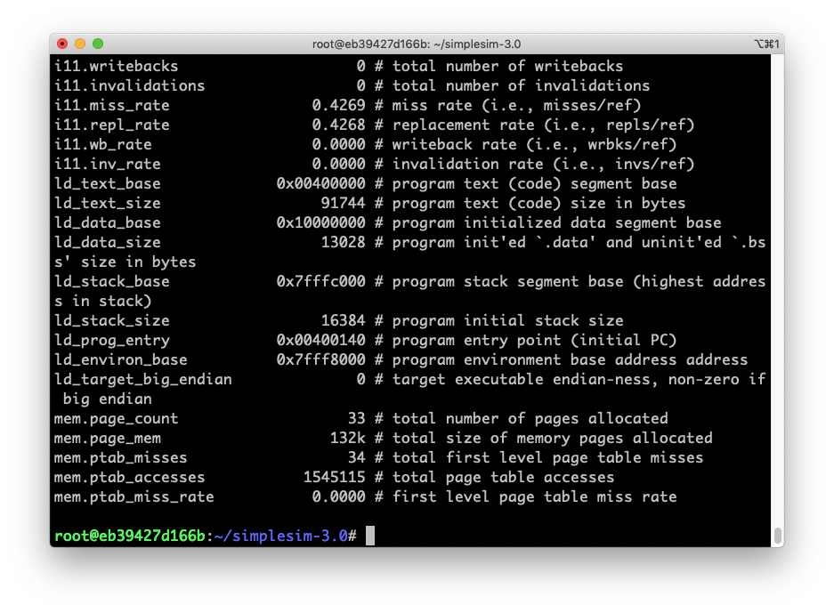

# Project 2 - Part 1

Zhicheng Zhang - G45149856


### 1. Introduction

Cache organization and associativity.


### 2. Implementation

#### Prepare

##### Environment

- Docker image [krlmlr/debian-ssh](krlmlr/debian-ssh) on Debian 10 (host).
- File `~/simplesim-3v0e.tgz` is downloaded from http://www.simplescalar.com/.
- File `~/lab_cache_1a.cfg` is downloaded from http://www.ecs.umass.edu/ece/koren/architecture/Simplescalar/lab1_cache_1a.cfg.
- File `~/lab_cache_2a.cfg` is downloaded from http://www.ecs.umass.edu/ece/koren/architecture/Simplescalar/lab1_cache_2a.cfg

##### Script

``` bash
# install
apt-get install tar build-essential

# unzip
tar zxvf simplesim-3v0e.tgz

# move
mv lab_cache_1a.cfg simplesim-3.0/
mv lab_cache_2a.cfg simplesim-3.0/

```

<div style="page-break-after: always;"></div>

#### Compile

``` bash
cd ~/simplesim-3.0
make clean
make config-pisa
make
make sim-tests
cd ~
```

#### Run

``` bash
cd ./simplesim-3.0/

# change file `lab1_cache_1a.cfg` and run several time
./sim-cache -config lab1_cache_1a.cfg tests-pisa/bin.little/test-math

# change file `lab1_cache_2a.cfg` and run several time
./sim-cache -config lab1_cache_2a.cfg tests-pisa/bin.little/test-math

```


### 3. Result



<div style="page-break-after: always;"></div>

### 4. Conclusion


| Miss Ratio (I-Cache) | 1-way  | 2-way  | 4-way  | 8-way  |
| -------------------- | ------ | ------ | ------ | ------ |
| 32 sets              | 0.4269 | 0.3735 | 0.2880 | 0.1983 |
| 64 sets              | 0.3765 | 0.2921 | 0.2256 | 0.1614 |
| 128 sets             | 0.3031 | 0.2268 | 0.1619 | 0.1028 |
| 256 sets             | 0.2504 | 0.1720 | 0.0994 | 0.0176 |
| 512 sets             | 0.1834 | 0.1010 | 0.0348 | 0.0142 |


.png)

<div style="page-break-after: always;"></div>

| Miss Ratio (D-Cache) | 1-way  | 2-way  | 4-way  | 8-way  |
| -------------------- | ------ | ------ | ------ | ------ |
| 32 sets              | 0.1372 | 0.0503 | 0.0236 | 0.0185 |
| 64 sets              | 0.0654 | 0.0280 | 0.0187 | 0.0184 |
| 128 sets             | 0.0408 | 0.0223 | 0.0184 | 0.0177 |
| 256 sets             | 0.0273 | 0.0195 | 0.0177 | 0.0176 |
| 512 sets             | 0.0209 | 0.0179 | 0.0176 | 0.0176 |


.png)

<div style="page-break-after: always;"></div>

### 5. Discussion

> 1. For a given number of sets, what effect does increasing associativity have on the miss ratio?

The miss ratio will decrease during increasing associativity for fixed number of sets.

> 2. For a given associativity, what is the effect of increasing the number of sets?

The miss ratio will decrease during increasing the number of sets for fixed associativity.

> 3. For a given cache size, how does the miss ratio change when going from an associativity of one to two to four? Explain.

The miss ratio will decrease during increasing associativity for fixed cache size.

> 4. If you were to design a Instruction cache, limited to a total cache size of 4 Kbytes, which cache organization would you choose, based solely on performance?

I would like to choose the organization of "16 bytes - 32 sets - 8 ways".

> 5. If you were to design a data cache, limited to a total cache size of 4 Kbytes, which cache organization would you choose, based solely on performance?

I would like to choose the organization of "16 bytes - 32 sets - 8 ways".

