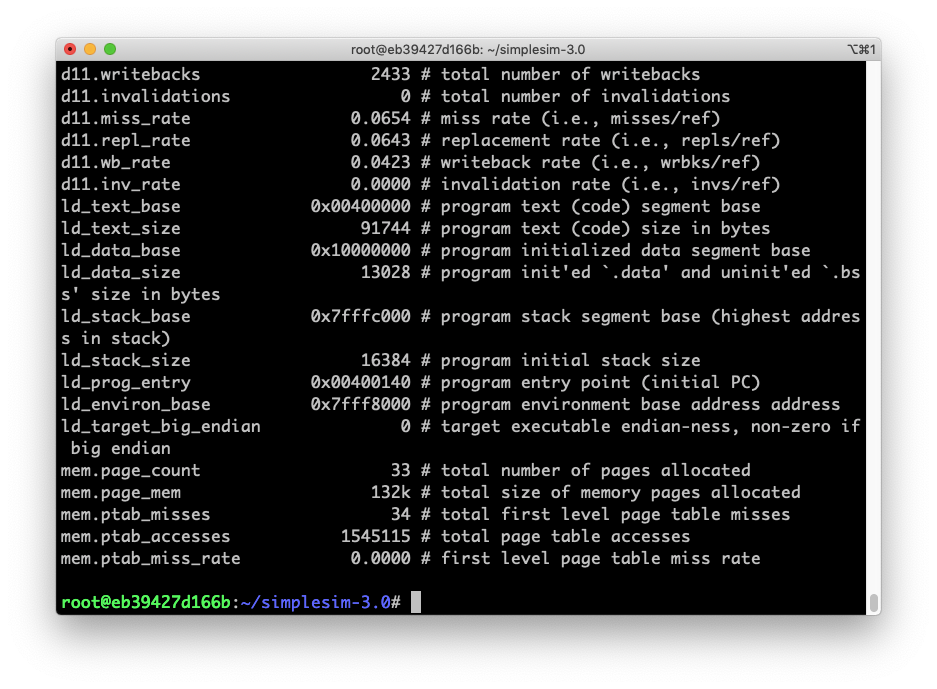
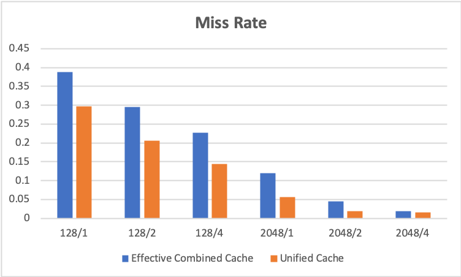

# Project 2 - Part 2

Zhicheng Zhang - G45149856


### 1. Introduction

Cache organization with unified/separate instruction and data caches.


### 2. Implementation

#### Prepare

##### Environment

- Docker image [krlmlr/debian-ssh](krlmlr/debian-ssh) on Debian 10 (host).
- File `~/simplesim-3v0e.tgz` is downloaded from http://www.simplescalar.com/.

##### Script

``` bash
# install
apt-get install tar build-essential

# unzip
tar zxvf simplesim-3v0e.tgz

```

#### Compile

``` bash
cd ~/simplesim-3.0
make clean
make config-pisa
make
make sim-tests
cd ~
```

#### Run

``` bash
cd ./simplesim-3.0/

# 128/1
./sim-cache -cache:il1 i11:64:16:1:l -cache:dl1 d11:64:16:1:l -cache:il2 none -cache:dl2 none -tlb:itlb none -tlb:dtlb none tests-pisa/bin.little/test-math
./sim-cache -cache:il1 dl1 -cache:dl1 ul1:128:16:1:l -cache:il2 none -cache:dl2 none -tlb:itlb none -tlb:dtlb none tests-pisa/bin.little/test-math

# 128/2
./sim-cache -cache:il1 i11:64:16:2:l -cache:dl1 d11:64:16:2:l -cache:il2 none -cache:dl2 none -tlb:itlb none -tlb:dtlb none tests-pisa/bin.little/test-math
./sim-cache -cache:il1 dl1 -cache:dl1 ul1:128:16:2:l -cache:il2 none -cache:dl2 none -tlb:itlb none -tlb:dtlb none tests-pisa/bin.little/test-math

# 128/4
./sim-cache -cache:il1 i11:64:16:4:l -cache:dl1 d11:64:16:4:l -cache:il2 none -cache:dl2 none -tlb:itlb none -tlb:dtlb none tests-pisa/bin.little/test-math
./sim-cache -cache:il1 dl1 -cache:dl1 ul1:128:16:4:l -cache:il2 none -cache:dl2 none -tlb:itlb none -tlb:dtlb none tests-pisa/bin.little/test-math

# 2048/1
./sim-cache -cache:il1 i11:1024:16:1:l -cache:dl1 d11:1024:16:1:l -cache:il2 none -cache:dl2 none -tlb:itlb none -tlb:dtlb none tests-pisa/bin.little/test-math
./sim-cache -cache:il1 dl1 -cache:dl1 ul1:2048:16:1:l -cache:il2 none -cache:dl2 none -tlb:itlb none -tlb:dtlb none tests-pisa/bin.little/test-math

# 2048/2
./sim-cache -cache:il1 i11:1024:16:2:l -cache:dl1 d11:1024:16:2:l -cache:il2 none -cache:dl2 none -tlb:itlb none -tlb:dtlb none tests-pisa/bin.little/test-math
./sim-cache -cache:il1 dl1 -cache:dl1 ul1:2048:16:2:l -cache:il2 none -cache:dl2 none -tlb:itlb none -tlb:dtlb none tests-pisa/bin.little/test-math

# 2048/4
./sim-cache -cache:il1 i11:1024:16:4:l -cache:dl1 d11:1024:16:4:l -cache:il2 none -cache:dl2 none -tlb:itlb none -tlb:dtlb none tests-pisa/bin.little/test-math
./sim-cache -cache:il1 dl1 -cache:dl1 ul1:2048:16:4:l -cache:il2 none -cache:dl2 none -tlb:itlb none -tlb:dtlb none tests-pisa/bin.little/test-math
```

<div style="page-break-after: always;"></div>

### 3. Result



<div style="page-break-after: always;"></div>

### 4. Conclusion

| Sets/Assoc | I-Cache Miss No (N/2 sets) | D-Cache Miss No (N/2 sets) | Effective Combined Cache Miss Rate | Unified Cache Miss Rate |
| ---------- | -------------------------- | -------------------------- | ---------------------------------- | ----------------------- |
| 128/1      | 64                         | 64                         | 0.3878                             | 0.2971                  |
| 128/2      | 64                         | 64                         | 0.2948                             | 0.2060                  |
| 128/4      | 64                         | 64                         | 0.2265                             | 0.1438                  |
| 2048/1     | 1024                       | 1024                       | 0.1201                             | 0.0554                  |
| 2048/2     | 1024                       | 1024                       | 0.0454                             | 0.0184                  |
| 2048/4     | 1024                       | 1024                       | 0.0186                             | 0.0149                  |




### 5. Discussion

It seems that the miss rate of the unified cache is usually smaller than which of the separate cache.

