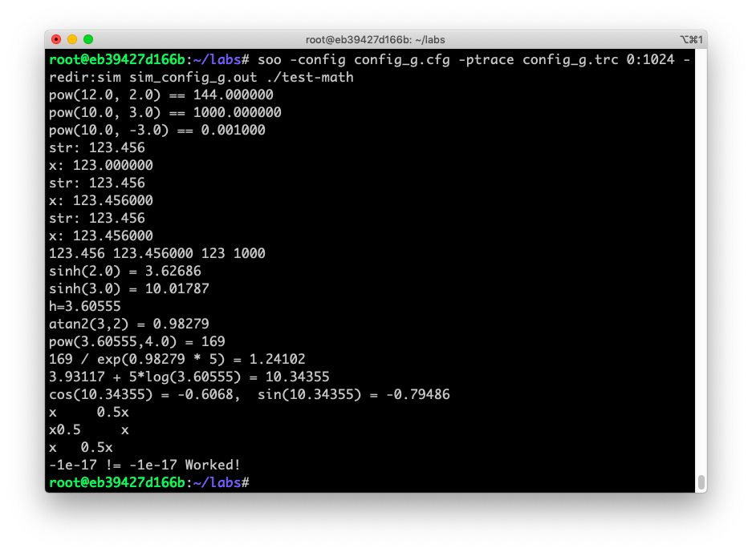

# Project 3

Zhicheng Zhang - G45149856


### 1. Introduction

Pipelining and Superscalar.


### 2. Implementation

#### Prepare

##### Environment

- Docker image [krlmlr/debian-ssh](krlmlr/debian-ssh) on Debian 10 (host).
- File `~/simplesim-3v0e.tgz` is downloaded from http://www.simplescalar.com/.

##### Script

``` bash
# install
apt-get install tar build-essential

# unzip
tar zxvf simplesim-3v0e.tgz

```

#### Compile

``` bash
cd ~/simplesim-3.0
make clean
make config-pisa
make
make sim-tests
cd ~

```

<div style="page-break-after: always;"></div>

#### Config

##### Script

``` bash
mkdir labs
cp ~/simplesim-3.0/config/default.cfg ~/labs/config_a.cfg
cp ~/simplesim-3.0/tests-pisa/bin.little/test-math ~/labs/
cd labs/
vim config_a.cfg
vim config_b.cfg
vim config_c.cfg
vim config_d.cfg
vim config_e.cfg
vim config_f.cfg
vim config_g.cfg
alias soo='~/simplesim-3.0/sim-outorder'
alias pv='~/simplesim-3.0/pipeview.pl'
cd ~

```

##### File

```
# config_a

-decode:width 4
-fetch:ifqsize 4
-lsq:size 8
-ruu:size 8
-issue:width 1
-res:memport 1
-issue:inorder true
-res:ialu 1
-res:imult 1
-res:fpalu 1
-res:fpmult 1
```

```
# config_b

-decode:width 4
-fetch:ifqsize 4
-lsq:size 8
-ruu:size 8
-issue:width 1
-res:memport 1
-issue:inorder false
-res:ialu 1
-res:imult 1
-res:fpalu 1
-res:fpmult 1
```

```
# config_c

-decode:width 4
-fetch:ifqsize 4
-lsq:size 8
-ruu:size 8
-issue:width 1
-res:memport 1
-issue:inorder true
-res:ialu 4
-res:imult 4
-res:fpalu 4
-res:fpmult 4
```

```
# config_d

-decode:width 4
-fetch:ifqsize 4
-lsq:size 8
-ruu:size 8
-issue:width 1
-res:memport 1
-issue:inorder false
-res:ialu 4
-res:imult 4
-res:fpalu 4
-res:fpmult 4
```

```
# config_e

-decode:width 4
-fetch:ifqsize 4
-lsq:size 8
-ruu:size 8
-issue:width 4
-res:memport 4
-issue:inorder false
-res:ialu 1
-res:imult 1
-res:fpalu 1
-res:fpmult 1
```

```
# config_f

-decode:width 4
-fetch:ifqsize 4
-lsq:size 8
-ruu:size 8
-issue:width 4
-res:memport 4
-issue:inorder false
-res:ialu 4
-res:imult 4
-res:fpalu 4
-res:fpmult 4
```

```
# config_g

-decode:width 4
-fetch:ifqsize 4
-lsq:size 8
-ruu:size 16
-issue:width 4
-res:memport 4
-issue:inorder false
-res:ialu 4
-res:imult 4
-res:fpalu 4
-res:fpmult 4
```

<div style="page-break-after: always;"></div>

#### Run

``` bash
cd ~/labs
soo -config config_a.cfg -ptrace config_a.trc 0:1024 -redir:sim sim_config_a.out ./test-math
soo -config config_b.cfg -ptrace config_b.trc 0:1024 -redir:sim sim_config_b.out ./test-math
soo -config config_c.cfg -ptrace config_c.trc 0:1024 -redir:sim sim_config_c.out ./test-math
soo -config config_d.cfg -ptrace config_d.trc 0:1024 -redir:sim sim_config_d.out ./test-math
soo -config config_e.cfg -ptrace config_e.trc 0:1024 -redir:sim sim_config_e.out ./test-math
soo -config config_f.cfg -ptrace config_f.trc 0:1024 -redir:sim sim_config_f.out ./test-math
soo -config config_g.cfg -ptrace config_g.trc 0:1024 -redir:sim sim_config_g.out ./test-math

```


### 3. Result



<div style="page-break-after: always;"></div>

### 4. Conclusion

*This part seems too long to read.*

*If you would like to skip it, just go to **the last-3rd page** to see the part of "5. Discussion".*

#### config_a

```
sim: ** simulation statistics **
sim_num_insn                 213598 # total number of instructions committed
sim_num_refs                  56890 # total number of loads and stores committed
sim_num_loads                 34096 # total number of loads committed
sim_num_stores           22794.0000 # total number of stores committed
sim_num_branches              38571 # total number of branches committed
sim_elapsed_time                  1 # total simulation time in seconds
sim_inst_rate           213598.0000 # simulation speed (in insts/sec)
sim_total_insn               219022 # total number of instructions executed
sim_total_refs                58314 # total number of loads and stores executed
sim_total_loads               35232 # total number of loads executed
sim_total_stores         23082.0000 # total number of stores executed
sim_total_branches            39719 # total number of branches executed
sim_cycle                    368591 # total simulation time in cycles
sim_IPC                      0.5795 # instructions per cycle
sim_CPI                      1.7256 # cycles per instruction
sim_exec_BW                  0.5942 # total instructions (mis-spec + committed) per cycle
sim_IPB                      5.5378 # instruction per branch
IFQ_count                   1009897 # cumulative IFQ occupancy
IFQ_fcount                   224756 # cumulative IFQ full count
ifq_occupancy                2.7399 # avg IFQ occupancy (insn's)
ifq_rate                     0.5942 # avg IFQ dispatch rate (insn/cycle)
ifq_latency                  4.6109 # avg IFQ occupant latency (cycle's)
ifq_full                     0.6098 # fraction of time (cycle's) IFQ was full
RUU_count                    916280 # cumulative RUU occupancy
RUU_fcount                     1436 # cumulative RUU full count
ruu_occupancy                2.4859 # avg RUU occupancy (insn's)
ruu_rate                     0.5942 # avg RUU dispatch rate (insn/cycle)
ruu_latency                  4.1835 # avg RUU occupant latency (cycle's)
ruu_full                     0.0039 # fraction of time (cycle's) RUU was full
LSQ_count                    246205 # cumulative LSQ occupancy
LSQ_fcount                        0 # cumulative LSQ full count
lsq_occupancy                0.6680 # avg LSQ occupancy (insn's)
lsq_rate                     0.5942 # avg LSQ dispatch rate (insn/cycle)
lsq_latency                  1.1241 # avg LSQ occupant latency (cycle's)
lsq_full                     0.0000 # fraction of time (cycle's) LSQ was full
sim_slip                    1423560 # total number of slip cycles
avg_sim_slip                 6.6647 # the average slip between issue and retirement
bpred_bimod.lookups           41442 # total number of bpred lookups
bpred_bimod.updates           38571 # total number of updates
bpred_bimod.addr_hits         34621 # total number of address-predicted hits
bpred_bimod.dir_hits          35114 # total number of direction-predicted hits (includes addr-hits)
bpred_bimod.misses             3457 # total number of misses
bpred_bimod.jr_hits            3520 # total number of address-predicted hits for JR's
bpred_bimod.jr_seen            3542 # total number of JR's seen
bpred_bimod.jr_non_ras_hits.PP           28 # total number of address-predicted hits for non-RAS JR's
bpred_bimod.jr_non_ras_seen.PP           41 # total number of non-RAS JR's seen
bpred_bimod.bpred_addr_rate    0.8976 # branch address-prediction rate (i.e., addr-hits/updates)
bpred_bimod.bpred_dir_rate    0.9104 # branch direction-prediction rate (i.e., all-hits/updates)
bpred_bimod.bpred_jr_rate    0.9938 # JR address-prediction rate (i.e., JR addr-hits/JRs seen)
bpred_bimod.bpred_jr_non_ras_rate.PP    0.6829 # non-RAS JR addr-pred rate (ie, non-RAS JR hits/JRs seen)
bpred_bimod.retstack_pushes         3662 # total number of address pushed onto ret-addr stack
bpred_bimod.retstack_pops         4352 # total number of address popped off of ret-addr stack
bpred_bimod.used_ras.PP         3501 # total number of RAS predictions used
bpred_bimod.ras_hits.PP         3492 # total number of RAS hits
bpred_bimod.ras_rate.PP    0.9974 # RAS prediction rate (i.e., RAS hits/used RAS)
il1.accesses                 243652 # total number of accesses
il1.hits                     227647 # total number of hits
il1.misses                    16005 # total number of misses
il1.replacements              15494 # total number of replacements
il1.writebacks                    0 # total number of writebacks
il1.invalidations                 0 # total number of invalidations
il1.miss_rate                0.0657 # miss rate (i.e., misses/ref)
il1.repl_rate                0.0636 # replacement rate (i.e., repls/ref)
il1.wb_rate                  0.0000 # writeback rate (i.e., wrbks/ref)
il1.inv_rate                 0.0000 # invalidation rate (i.e., invs/ref)
dl1.accesses                  56890 # total number of accesses
dl1.hits                      56342 # total number of hits
dl1.misses                      548 # total number of misses
dl1.replacements                 64 # total number of replacements
dl1.writebacks                   59 # total number of writebacks
dl1.invalidations                 0 # total number of invalidations
dl1.miss_rate                0.0096 # miss rate (i.e., misses/ref)
dl1.repl_rate                0.0011 # replacement rate (i.e., repls/ref)
dl1.wb_rate                  0.0010 # writeback rate (i.e., wrbks/ref)
dl1.inv_rate                 0.0000 # invalidation rate (i.e., invs/ref)
ul2.accesses                  16612 # total number of accesses
ul2.hits                      15392 # total number of hits
ul2.misses                     1220 # total number of misses
ul2.replacements                  0 # total number of replacements
ul2.writebacks                    0 # total number of writebacks
ul2.invalidations                 0 # total number of invalidations
ul2.miss_rate                0.0734 # miss rate (i.e., misses/ref)
ul2.repl_rate                0.0000 # replacement rate (i.e., repls/ref)
ul2.wb_rate                  0.0000 # writeback rate (i.e., wrbks/ref)
ul2.inv_rate                 0.0000 # invalidation rate (i.e., invs/ref)
itlb.accesses                243652 # total number of accesses
itlb.hits                    243629 # total number of hits
itlb.misses                      23 # total number of misses
itlb.replacements                 0 # total number of replacements
itlb.writebacks                   0 # total number of writebacks
itlb.invalidations                0 # total number of invalidations
itlb.miss_rate               0.0001 # miss rate (i.e., misses/ref)
itlb.repl_rate               0.0000 # replacement rate (i.e., repls/ref)
itlb.wb_rate                 0.0000 # writeback rate (i.e., wrbks/ref)
itlb.inv_rate                0.0000 # invalidation rate (i.e., invs/ref)
dtlb.accesses                 56890 # total number of accesses
dtlb.hits                     56880 # total number of hits
dtlb.misses                      10 # total number of misses
dtlb.replacements                 0 # total number of replacements
dtlb.writebacks                   0 # total number of writebacks
dtlb.invalidations                0 # total number of invalidations
dtlb.miss_rate               0.0002 # miss rate (i.e., misses/ref)
dtlb.repl_rate               0.0000 # replacement rate (i.e., repls/ref)
dtlb.wb_rate                 0.0000 # writeback rate (i.e., wrbks/ref)
dtlb.inv_rate                0.0000 # invalidation rate (i.e., invs/ref)
sim_invalid_addrs                 0 # total non-speculative bogus addresses seen (debug var)
ld_text_base             0x00400000 # program text (code) segment base
ld_text_size                  91744 # program text (code) size in bytes
ld_data_base             0x10000000 # program initialized data segment base
ld_data_size                  13028 # program init'ed `.data' and uninit'ed `.bss' size in bytes
ld_stack_base            0x7fffc000 # program stack segment base (highest address in stack)
ld_stack_size                 16384 # program initial stack size
ld_prog_entry            0x00400140 # program entry point (initial PC)
ld_environ_base          0x7fff8000 # program environment base address address
ld_target_big_endian              0 # target executable endian-ness, non-zero if big endian
mem.page_count                   33 # total number of pages allocated
mem.page_mem                   132k # total size of memory pages allocated
mem.ptab_misses                  37 # total first level page table misses
mem.ptab_accesses           1964554 # total page table accesses
mem.ptab_miss_rate           0.0000 # first level page table miss rate
```

#### config_b

```
sim: ** simulation statistics **
sim_num_insn                 213598 # total number of instructions committed
sim_num_refs                  56890 # total number of loads and stores committed
sim_num_loads                 34096 # total number of loads committed
sim_num_stores           22794.0000 # total number of stores committed
sim_num_branches              38571 # total number of branches committed
sim_elapsed_time                  1 # total simulation time in seconds
sim_inst_rate           213598.0000 # simulation speed (in insts/sec)
sim_total_insn               227937 # total number of instructions executed
sim_total_refs                60728 # total number of loads and stores executed
sim_total_loads               36672 # total number of loads executed
sim_total_stores         24056.0000 # total number of stores executed
sim_total_branches            41589 # total number of branches executed
sim_cycle                    350523 # total simulation time in cycles
sim_IPC                      0.6094 # instructions per cycle
sim_CPI                      1.6410 # cycles per instruction
sim_exec_BW                  0.6503 # total instructions (mis-spec + committed) per cycle
sim_IPB                      5.5378 # instruction per branch
IFQ_count                    893582 # cumulative IFQ occupancy
IFQ_fcount                   209899 # cumulative IFQ full count
ifq_occupancy                2.5493 # avg IFQ occupancy (insn's)
ifq_rate                     0.6503 # avg IFQ dispatch rate (insn/cycle)
ifq_latency                  3.9203 # avg IFQ occupant latency (cycle's)
ifq_full                     0.5988 # fraction of time (cycle's) IFQ was full
RUU_count                   2070304 # cumulative RUU occupancy
RUU_fcount                   216064 # cumulative RUU full count
ruu_occupancy                5.9063 # avg RUU occupancy (insn's)
ruu_rate                     0.6503 # avg RUU dispatch rate (insn/cycle)
ruu_latency                  9.0828 # avg RUU occupant latency (cycle's)
ruu_full                     0.6164 # fraction of time (cycle's) RUU was full
LSQ_count                    567451 # cumulative LSQ occupancy
LSQ_fcount                     1706 # cumulative LSQ full count
lsq_occupancy                1.6189 # avg LSQ occupancy (insn's)
lsq_rate                     0.6503 # avg LSQ dispatch rate (insn/cycle)
lsq_latency                  2.4895 # avg LSQ occupant latency (cycle's)
lsq_full                     0.0049 # fraction of time (cycle's) LSQ was full
sim_slip                    2847369 # total number of slip cycles
avg_sim_slip                13.3305 # the average slip between issue and retirement
bpred_bimod.lookups           43806 # total number of bpred lookups
bpred_bimod.updates           38571 # total number of updates
bpred_bimod.addr_hits         34411 # total number of address-predicted hits
bpred_bimod.dir_hits          35114 # total number of direction-predicted hits (includes addr-hits)
bpred_bimod.misses             3457 # total number of misses
bpred_bimod.jr_hits            3311 # total number of address-predicted hits for JR's
bpred_bimod.jr_seen            3542 # total number of JR's seen
bpred_bimod.jr_non_ras_hits.PP           28 # total number of address-predicted hits for non-RAS JR's
bpred_bimod.jr_non_ras_seen.PP           41 # total number of non-RAS JR's seen
bpred_bimod.bpred_addr_rate    0.8921 # branch address-prediction rate (i.e., addr-hits/updates)
bpred_bimod.bpred_dir_rate    0.9104 # branch direction-prediction rate (i.e., all-hits/updates)
bpred_bimod.bpred_jr_rate    0.9348 # JR address-prediction rate (i.e., JR addr-hits/JRs seen)
bpred_bimod.bpred_jr_non_ras_rate.PP    0.6829 # non-RAS JR addr-pred rate (ie, non-RAS JR hits/JRs seen)
bpred_bimod.retstack_pushes         3905 # total number of address pushed onto ret-addr stack
bpred_bimod.retstack_pops         4511 # total number of address popped off of ret-addr stack
bpred_bimod.used_ras.PP         3501 # total number of RAS predictions used
bpred_bimod.ras_hits.PP         3283 # total number of RAS hits
bpred_bimod.ras_rate.PP    0.9377 # RAS prediction rate (i.e., RAS hits/used RAS)
il1.accesses                 253460 # total number of accesses
il1.hits                     237329 # total number of hits
il1.misses                    16131 # total number of misses
il1.replacements              15620 # total number of replacements
il1.writebacks                    0 # total number of writebacks
il1.invalidations                 0 # total number of invalidations
il1.miss_rate                0.0636 # miss rate (i.e., misses/ref)
il1.repl_rate                0.0616 # replacement rate (i.e., repls/ref)
il1.wb_rate                  0.0000 # writeback rate (i.e., wrbks/ref)
il1.inv_rate                 0.0000 # invalidation rate (i.e., invs/ref)
dl1.accesses                  56907 # total number of accesses
dl1.hits                      56357 # total number of hits
dl1.misses                      550 # total number of misses
dl1.replacements                 65 # total number of replacements
dl1.writebacks                   60 # total number of writebacks
dl1.invalidations                 0 # total number of invalidations
dl1.miss_rate                0.0097 # miss rate (i.e., misses/ref)
dl1.repl_rate                0.0011 # replacement rate (i.e., repls/ref)
dl1.wb_rate                  0.0011 # writeback rate (i.e., wrbks/ref)
dl1.inv_rate                 0.0000 # invalidation rate (i.e., invs/ref)
ul2.accesses                  16741 # total number of accesses
ul2.hits                      15521 # total number of hits
ul2.misses                     1220 # total number of misses
ul2.replacements                  0 # total number of replacements
ul2.writebacks                    0 # total number of writebacks
ul2.invalidations                 0 # total number of invalidations
ul2.miss_rate                0.0729 # miss rate (i.e., misses/ref)
ul2.repl_rate                0.0000 # replacement rate (i.e., repls/ref)
ul2.wb_rate                  0.0000 # writeback rate (i.e., wrbks/ref)
ul2.inv_rate                 0.0000 # invalidation rate (i.e., invs/ref)
itlb.accesses                253460 # total number of accesses
itlb.hits                    253437 # total number of hits
itlb.misses                      23 # total number of misses
itlb.replacements                 0 # total number of replacements
itlb.writebacks                   0 # total number of writebacks
itlb.invalidations                0 # total number of invalidations
itlb.miss_rate               0.0001 # miss rate (i.e., misses/ref)
itlb.repl_rate               0.0000 # replacement rate (i.e., repls/ref)
itlb.wb_rate                 0.0000 # writeback rate (i.e., wrbks/ref)
itlb.inv_rate                0.0000 # invalidation rate (i.e., invs/ref)
dtlb.accesses                 56907 # total number of accesses
dtlb.hits                     56897 # total number of hits
dtlb.misses                      10 # total number of misses
dtlb.replacements                 0 # total number of replacements
dtlb.writebacks                   0 # total number of writebacks
dtlb.invalidations                0 # total number of invalidations
dtlb.miss_rate               0.0002 # miss rate (i.e., misses/ref)
dtlb.repl_rate               0.0000 # replacement rate (i.e., repls/ref)
dtlb.wb_rate                 0.0000 # writeback rate (i.e., wrbks/ref)
dtlb.inv_rate                0.0000 # invalidation rate (i.e., invs/ref)
sim_invalid_addrs                 0 # total non-speculative bogus addresses seen (debug var)
ld_text_base             0x00400000 # program text (code) segment base
ld_text_size                  91744 # program text (code) size in bytes
ld_data_base             0x10000000 # program initialized data segment base
ld_data_size                  13028 # program init'ed `.data' and uninit'ed `.bss' size in bytes
ld_stack_base            0x7fffc000 # program stack segment base (highest address in stack)
ld_stack_size                 16384 # program initial stack size
ld_prog_entry            0x00400140 # program entry point (initial PC)
ld_environ_base          0x7fff8000 # program environment base address address
ld_target_big_endian              0 # target executable endian-ness, non-zero if big endian
mem.page_count                   33 # total number of pages allocated
mem.page_mem                   132k # total size of memory pages allocated
mem.ptab_misses                  37 # total first level page table misses
mem.ptab_accesses           2006598 # total page table accesses
mem.ptab_miss_rate           0.0000 # first level page table miss rate
```

#### config_c

```
sim: ** simulation statistics **
sim_num_insn                 213598 # total number of instructions committed
sim_num_refs                  56890 # total number of loads and stores committed
sim_num_loads                 34096 # total number of loads committed
sim_num_stores           22794.0000 # total number of stores committed
sim_num_branches              38571 # total number of branches committed
sim_elapsed_time                  1 # total simulation time in seconds
sim_inst_rate           213598.0000 # simulation speed (in insts/sec)
sim_total_insn               219022 # total number of instructions executed
sim_total_refs                58314 # total number of loads and stores executed
sim_total_loads               35232 # total number of loads executed
sim_total_stores         23082.0000 # total number of stores executed
sim_total_branches            39719 # total number of branches executed
sim_cycle                    368591 # total simulation time in cycles
sim_IPC                      0.5795 # instructions per cycle
sim_CPI                      1.7256 # cycles per instruction
sim_exec_BW                  0.5942 # total instructions (mis-spec + committed) per cycle
sim_IPB                      5.5378 # instruction per branch
IFQ_count                   1009897 # cumulative IFQ occupancy
IFQ_fcount                   224756 # cumulative IFQ full count
ifq_occupancy                2.7399 # avg IFQ occupancy (insn's)
ifq_rate                     0.5942 # avg IFQ dispatch rate (insn/cycle)
ifq_latency                  4.6109 # avg IFQ occupant latency (cycle's)
ifq_full                     0.6098 # fraction of time (cycle's) IFQ was full
RUU_count                    916280 # cumulative RUU occupancy
RUU_fcount                     1436 # cumulative RUU full count
ruu_occupancy                2.4859 # avg RUU occupancy (insn's)
ruu_rate                     0.5942 # avg RUU dispatch rate (insn/cycle)
ruu_latency                  4.1835 # avg RUU occupant latency (cycle's)
ruu_full                     0.0039 # fraction of time (cycle's) RUU was full
LSQ_count                    246205 # cumulative LSQ occupancy
LSQ_fcount                        0 # cumulative LSQ full count
lsq_occupancy                0.6680 # avg LSQ occupancy (insn's)
lsq_rate                     0.5942 # avg LSQ dispatch rate (insn/cycle)
lsq_latency                  1.1241 # avg LSQ occupant latency (cycle's)
lsq_full                     0.0000 # fraction of time (cycle's) LSQ was full
sim_slip                    1423560 # total number of slip cycles
avg_sim_slip                 6.6647 # the average slip between issue and retirement
bpred_bimod.lookups           41442 # total number of bpred lookups
bpred_bimod.updates           38571 # total number of updates
bpred_bimod.addr_hits         34621 # total number of address-predicted hits
bpred_bimod.dir_hits          35114 # total number of direction-predicted hits (includes addr-hits)
bpred_bimod.misses             3457 # total number of misses
bpred_bimod.jr_hits            3520 # total number of address-predicted hits for JR's
bpred_bimod.jr_seen            3542 # total number of JR's seen
bpred_bimod.jr_non_ras_hits.PP           28 # total number of address-predicted hits for non-RAS JR's
bpred_bimod.jr_non_ras_seen.PP           41 # total number of non-RAS JR's seen
bpred_bimod.bpred_addr_rate    0.8976 # branch address-prediction rate (i.e., addr-hits/updates)
bpred_bimod.bpred_dir_rate    0.9104 # branch direction-prediction rate (i.e., all-hits/updates)
bpred_bimod.bpred_jr_rate    0.9938 # JR address-prediction rate (i.e., JR addr-hits/JRs seen)
bpred_bimod.bpred_jr_non_ras_rate.PP    0.6829 # non-RAS JR addr-pred rate (ie, non-RAS JR hits/JRs seen)
bpred_bimod.retstack_pushes         3662 # total number of address pushed onto ret-addr stack
bpred_bimod.retstack_pops         4352 # total number of address popped off of ret-addr stack
bpred_bimod.used_ras.PP         3501 # total number of RAS predictions used
bpred_bimod.ras_hits.PP         3492 # total number of RAS hits
bpred_bimod.ras_rate.PP    0.9974 # RAS prediction rate (i.e., RAS hits/used RAS)
il1.accesses                 243652 # total number of accesses
il1.hits                     227647 # total number of hits
il1.misses                    16005 # total number of misses
il1.replacements              15494 # total number of replacements
il1.writebacks                    0 # total number of writebacks
il1.invalidations                 0 # total number of invalidations
il1.miss_rate                0.0657 # miss rate (i.e., misses/ref)
il1.repl_rate                0.0636 # replacement rate (i.e., repls/ref)
il1.wb_rate                  0.0000 # writeback rate (i.e., wrbks/ref)
il1.inv_rate                 0.0000 # invalidation rate (i.e., invs/ref)
dl1.accesses                  56890 # total number of accesses
dl1.hits                      56342 # total number of hits
dl1.misses                      548 # total number of misses
dl1.replacements                 64 # total number of replacements
dl1.writebacks                   59 # total number of writebacks
dl1.invalidations                 0 # total number of invalidations
dl1.miss_rate                0.0096 # miss rate (i.e., misses/ref)
dl1.repl_rate                0.0011 # replacement rate (i.e., repls/ref)
dl1.wb_rate                  0.0010 # writeback rate (i.e., wrbks/ref)
dl1.inv_rate                 0.0000 # invalidation rate (i.e., invs/ref)
ul2.accesses                  16612 # total number of accesses
ul2.hits                      15392 # total number of hits
ul2.misses                     1220 # total number of misses
ul2.replacements                  0 # total number of replacements
ul2.writebacks                    0 # total number of writebacks
ul2.invalidations                 0 # total number of invalidations
ul2.miss_rate                0.0734 # miss rate (i.e., misses/ref)
ul2.repl_rate                0.0000 # replacement rate (i.e., repls/ref)
ul2.wb_rate                  0.0000 # writeback rate (i.e., wrbks/ref)
ul2.inv_rate                 0.0000 # invalidation rate (i.e., invs/ref)
itlb.accesses                243652 # total number of accesses
itlb.hits                    243629 # total number of hits
itlb.misses                      23 # total number of misses
itlb.replacements                 0 # total number of replacements
itlb.writebacks                   0 # total number of writebacks
itlb.invalidations                0 # total number of invalidations
itlb.miss_rate               0.0001 # miss rate (i.e., misses/ref)
itlb.repl_rate               0.0000 # replacement rate (i.e., repls/ref)
itlb.wb_rate                 0.0000 # writeback rate (i.e., wrbks/ref)
itlb.inv_rate                0.0000 # invalidation rate (i.e., invs/ref)
dtlb.accesses                 56890 # total number of accesses
dtlb.hits                     56880 # total number of hits
dtlb.misses                      10 # total number of misses
dtlb.replacements                 0 # total number of replacements
dtlb.writebacks                   0 # total number of writebacks
dtlb.invalidations                0 # total number of invalidations
dtlb.miss_rate               0.0002 # miss rate (i.e., misses/ref)
dtlb.repl_rate               0.0000 # replacement rate (i.e., repls/ref)
dtlb.wb_rate                 0.0000 # writeback rate (i.e., wrbks/ref)
dtlb.inv_rate                0.0000 # invalidation rate (i.e., invs/ref)
sim_invalid_addrs                 0 # total non-speculative bogus addresses seen (debug var)
ld_text_base             0x00400000 # program text (code) segment base
ld_text_size                  91744 # program text (code) size in bytes
ld_data_base             0x10000000 # program initialized data segment base
ld_data_size                  13028 # program init'ed `.data' and uninit'ed `.bss' size in bytes
ld_stack_base            0x7fffc000 # program stack segment base (highest address in stack)
ld_stack_size                 16384 # program initial stack size
ld_prog_entry            0x00400140 # program entry point (initial PC)
ld_environ_base          0x7fff8000 # program environment base address address
ld_target_big_endian              0 # target executable endian-ness, non-zero if big endian
mem.page_count                   33 # total number of pages allocated
mem.page_mem                   132k # total size of memory pages allocated
mem.ptab_misses                  37 # total first level page table misses
mem.ptab_accesses           1964554 # total page table accesses
mem.ptab_miss_rate           0.0000 # first level page table miss rate
```

#### config_d

```
sim: ** simulation statistics **
sim_num_insn                 213598 # total number of instructions committed
sim_num_refs                  56890 # total number of loads and stores committed
sim_num_loads                 34096 # total number of loads committed
sim_num_stores           22794.0000 # total number of stores committed
sim_num_branches              38571 # total number of branches committed
sim_elapsed_time                  1 # total simulation time in seconds
sim_inst_rate           213598.0000 # simulation speed (in insts/sec)
sim_total_insn               227937 # total number of instructions executed
sim_total_refs                60728 # total number of loads and stores executed
sim_total_loads               36672 # total number of loads executed
sim_total_stores         24056.0000 # total number of stores executed
sim_total_branches            41589 # total number of branches executed
sim_cycle                    350523 # total simulation time in cycles
sim_IPC                      0.6094 # instructions per cycle
sim_CPI                      1.6410 # cycles per instruction
sim_exec_BW                  0.6503 # total instructions (mis-spec + committed) per cycle
sim_IPB                      5.5378 # instruction per branch
IFQ_count                    893582 # cumulative IFQ occupancy
IFQ_fcount                   209899 # cumulative IFQ full count
ifq_occupancy                2.5493 # avg IFQ occupancy (insn's)
ifq_rate                     0.6503 # avg IFQ dispatch rate (insn/cycle)
ifq_latency                  3.9203 # avg IFQ occupant latency (cycle's)
ifq_full                     0.5988 # fraction of time (cycle's) IFQ was full
RUU_count                   2070287 # cumulative RUU occupancy
RUU_fcount                   216065 # cumulative RUU full count
ruu_occupancy                5.9063 # avg RUU occupancy (insn's)
ruu_rate                     0.6503 # avg RUU dispatch rate (insn/cycle)
ruu_latency                  9.0827 # avg RUU occupant latency (cycle's)
ruu_full                     0.6164 # fraction of time (cycle's) RUU was full
LSQ_count                    567447 # cumulative LSQ occupancy
LSQ_fcount                     1706 # cumulative LSQ full count
lsq_occupancy                1.6189 # avg LSQ occupancy (insn's)
lsq_rate                     0.6503 # avg LSQ dispatch rate (insn/cycle)
lsq_latency                  2.4895 # avg LSQ occupant latency (cycle's)
lsq_full                     0.0049 # fraction of time (cycle's) LSQ was full
sim_slip                    2847348 # total number of slip cycles
avg_sim_slip                13.3304 # the average slip between issue and retirement
bpred_bimod.lookups           43806 # total number of bpred lookups
bpred_bimod.updates           38571 # total number of updates
bpred_bimod.addr_hits         34411 # total number of address-predicted hits
bpred_bimod.dir_hits          35114 # total number of direction-predicted hits (includes addr-hits)
bpred_bimod.misses             3457 # total number of misses
bpred_bimod.jr_hits            3311 # total number of address-predicted hits for JR's
bpred_bimod.jr_seen            3542 # total number of JR's seen
bpred_bimod.jr_non_ras_hits.PP           28 # total number of address-predicted hits for non-RAS JR's
bpred_bimod.jr_non_ras_seen.PP           41 # total number of non-RAS JR's seen
bpred_bimod.bpred_addr_rate    0.8921 # branch address-prediction rate (i.e., addr-hits/updates)
bpred_bimod.bpred_dir_rate    0.9104 # branch direction-prediction rate (i.e., all-hits/updates)
bpred_bimod.bpred_jr_rate    0.9348 # JR address-prediction rate (i.e., JR addr-hits/JRs seen)
bpred_bimod.bpred_jr_non_ras_rate.PP    0.6829 # non-RAS JR addr-pred rate (ie, non-RAS JR hits/JRs seen)
bpred_bimod.retstack_pushes         3905 # total number of address pushed onto ret-addr stack
bpred_bimod.retstack_pops         4511 # total number of address popped off of ret-addr stack
bpred_bimod.used_ras.PP         3501 # total number of RAS predictions used
bpred_bimod.ras_hits.PP         3283 # total number of RAS hits
bpred_bimod.ras_rate.PP    0.9377 # RAS prediction rate (i.e., RAS hits/used RAS)
il1.accesses                 253460 # total number of accesses
il1.hits                     237329 # total number of hits
il1.misses                    16131 # total number of misses
il1.replacements              15620 # total number of replacements
il1.writebacks                    0 # total number of writebacks
il1.invalidations                 0 # total number of invalidations
il1.miss_rate                0.0636 # miss rate (i.e., misses/ref)
il1.repl_rate                0.0616 # replacement rate (i.e., repls/ref)
il1.wb_rate                  0.0000 # writeback rate (i.e., wrbks/ref)
il1.inv_rate                 0.0000 # invalidation rate (i.e., invs/ref)
dl1.accesses                  56907 # total number of accesses
dl1.hits                      56357 # total number of hits
dl1.misses                      550 # total number of misses
dl1.replacements                 65 # total number of replacements
dl1.writebacks                   60 # total number of writebacks
dl1.invalidations                 0 # total number of invalidations
dl1.miss_rate                0.0097 # miss rate (i.e., misses/ref)
dl1.repl_rate                0.0011 # replacement rate (i.e., repls/ref)
dl1.wb_rate                  0.0011 # writeback rate (i.e., wrbks/ref)
dl1.inv_rate                 0.0000 # invalidation rate (i.e., invs/ref)
ul2.accesses                  16741 # total number of accesses
ul2.hits                      15521 # total number of hits
ul2.misses                     1220 # total number of misses
ul2.replacements                  0 # total number of replacements
ul2.writebacks                    0 # total number of writebacks
ul2.invalidations                 0 # total number of invalidations
ul2.miss_rate                0.0729 # miss rate (i.e., misses/ref)
ul2.repl_rate                0.0000 # replacement rate (i.e., repls/ref)
ul2.wb_rate                  0.0000 # writeback rate (i.e., wrbks/ref)
ul2.inv_rate                 0.0000 # invalidation rate (i.e., invs/ref)
itlb.accesses                253460 # total number of accesses
itlb.hits                    253437 # total number of hits
itlb.misses                      23 # total number of misses
itlb.replacements                 0 # total number of replacements
itlb.writebacks                   0 # total number of writebacks
itlb.invalidations                0 # total number of invalidations
itlb.miss_rate               0.0001 # miss rate (i.e., misses/ref)
itlb.repl_rate               0.0000 # replacement rate (i.e., repls/ref)
itlb.wb_rate                 0.0000 # writeback rate (i.e., wrbks/ref)
itlb.inv_rate                0.0000 # invalidation rate (i.e., invs/ref)
dtlb.accesses                 56907 # total number of accesses
dtlb.hits                     56897 # total number of hits
dtlb.misses                      10 # total number of misses
dtlb.replacements                 0 # total number of replacements
dtlb.writebacks                   0 # total number of writebacks
dtlb.invalidations                0 # total number of invalidations
dtlb.miss_rate               0.0002 # miss rate (i.e., misses/ref)
dtlb.repl_rate               0.0000 # replacement rate (i.e., repls/ref)
dtlb.wb_rate                 0.0000 # writeback rate (i.e., wrbks/ref)
dtlb.inv_rate                0.0000 # invalidation rate (i.e., invs/ref)
sim_invalid_addrs                 0 # total non-speculative bogus addresses seen (debug var)
ld_text_base             0x00400000 # program text (code) segment base
ld_text_size                  91744 # program text (code) size in bytes
ld_data_base             0x10000000 # program initialized data segment base
ld_data_size                  13028 # program init'ed `.data' and uninit'ed `.bss' size in bytes
ld_stack_base            0x7fffc000 # program stack segment base (highest address in stack)
ld_stack_size                 16384 # program initial stack size
ld_prog_entry            0x00400140 # program entry point (initial PC)
ld_environ_base          0x7fff8000 # program environment base address address
ld_target_big_endian              0 # target executable endian-ness, non-zero if big endian
mem.page_count                   33 # total number of pages allocated
mem.page_mem                   132k # total size of memory pages allocated
mem.ptab_misses                  37 # total first level page table misses
mem.ptab_accesses           2006598 # total page table accesses
mem.ptab_miss_rate           0.0000 # first level page table miss rate
```

#### config_e

```
sim: ** simulation statistics **
sim_num_insn                 213598 # total number of instructions committed
sim_num_refs                  56890 # total number of loads and stores committed
sim_num_loads                 34096 # total number of loads committed
sim_num_stores           22794.0000 # total number of stores committed
sim_num_branches              38571 # total number of branches committed
sim_elapsed_time                  1 # total simulation time in seconds
sim_inst_rate           213598.0000 # simulation speed (in insts/sec)
sim_total_insn               227292 # total number of instructions executed
sim_total_refs                60580 # total number of loads and stores executed
sim_total_loads               36590 # total number of loads executed
sim_total_stores         23990.0000 # total number of stores executed
sim_total_branches            41566 # total number of branches executed
sim_cycle                    307391 # total simulation time in cycles
sim_IPC                      0.6949 # instructions per cycle
sim_CPI                      1.4391 # cycles per instruction
sim_exec_BW                  0.7394 # total instructions (mis-spec + committed) per cycle
sim_IPB                      5.5378 # instruction per branch
IFQ_count                    709474 # cumulative IFQ occupancy
IFQ_fcount                   165191 # cumulative IFQ full count
ifq_occupancy                2.3081 # avg IFQ occupancy (insn's)
ifq_rate                     0.7394 # avg IFQ dispatch rate (insn/cycle)
ifq_latency                  3.1214 # avg IFQ occupant latency (cycle's)
ifq_full                     0.5374 # fraction of time (cycle's) IFQ was full
RUU_count                   1628971 # cumulative RUU occupancy
RUU_fcount                   164288 # cumulative RUU full count
ruu_occupancy                5.2993 # avg RUU occupancy (insn's)
ruu_rate                     0.7394 # avg RUU dispatch rate (insn/cycle)
ruu_latency                  7.1669 # avg RUU occupant latency (cycle's)
ruu_full                     0.5345 # fraction of time (cycle's) RUU was full
LSQ_count                    417278 # cumulative LSQ occupancy
LSQ_fcount                      959 # cumulative LSQ full count
lsq_occupancy                1.3575 # avg LSQ occupancy (insn's)
lsq_rate                     0.7394 # avg LSQ dispatch rate (insn/cycle)
lsq_latency                  1.8359 # avg LSQ occupant latency (cycle's)
lsq_full                     0.0031 # fraction of time (cycle's) LSQ was full
sim_slip                    2272410 # total number of slip cycles
avg_sim_slip                10.6387 # the average slip between issue and retirement
bpred_bimod.lookups           43739 # total number of bpred lookups
bpred_bimod.updates           38571 # total number of updates
bpred_bimod.addr_hits         34415 # total number of address-predicted hits
bpred_bimod.dir_hits          35114 # total number of direction-predicted hits (includes addr-hits)
bpred_bimod.misses             3457 # total number of misses
bpred_bimod.jr_hits            3315 # total number of address-predicted hits for JR's
bpred_bimod.jr_seen            3542 # total number of JR's seen
bpred_bimod.jr_non_ras_hits.PP           28 # total number of address-predicted hits for non-RAS JR's
bpred_bimod.jr_non_ras_seen.PP           41 # total number of non-RAS JR's seen
bpred_bimod.bpred_addr_rate    0.8923 # branch address-prediction rate (i.e., addr-hits/updates)
bpred_bimod.bpred_dir_rate    0.9104 # branch direction-prediction rate (i.e., all-hits/updates)
bpred_bimod.bpred_jr_rate    0.9359 # JR address-prediction rate (i.e., JR addr-hits/JRs seen)
bpred_bimod.bpred_jr_non_ras_rate.PP    0.6829 # non-RAS JR addr-pred rate (ie, non-RAS JR hits/JRs seen)
bpred_bimod.retstack_pushes         3914 # total number of address pushed onto ret-addr stack
bpred_bimod.retstack_pops         4509 # total number of address popped off of ret-addr stack
bpred_bimod.used_ras.PP         3501 # total number of RAS predictions used
bpred_bimod.ras_hits.PP         3287 # total number of RAS hits
bpred_bimod.ras_rate.PP    0.9389 # RAS prediction rate (i.e., RAS hits/used RAS)
il1.accesses                 252224 # total number of accesses
il1.hits                     236110 # total number of hits
il1.misses                    16114 # total number of misses
il1.replacements              15603 # total number of replacements
il1.writebacks                    0 # total number of writebacks
il1.invalidations                 0 # total number of invalidations
il1.miss_rate                0.0639 # miss rate (i.e., misses/ref)
il1.repl_rate                0.0619 # replacement rate (i.e., repls/ref)
il1.wb_rate                  0.0000 # writeback rate (i.e., wrbks/ref)
il1.inv_rate                 0.0000 # invalidation rate (i.e., invs/ref)
dl1.accesses                  56954 # total number of accesses
dl1.hits                      56404 # total number of hits
dl1.misses                      550 # total number of misses
dl1.replacements                 65 # total number of replacements
dl1.writebacks                   60 # total number of writebacks
dl1.invalidations                 0 # total number of invalidations
dl1.miss_rate                0.0097 # miss rate (i.e., misses/ref)
dl1.repl_rate                0.0011 # replacement rate (i.e., repls/ref)
dl1.wb_rate                  0.0011 # writeback rate (i.e., wrbks/ref)
dl1.inv_rate                 0.0000 # invalidation rate (i.e., invs/ref)
ul2.accesses                  16724 # total number of accesses
ul2.hits                      15504 # total number of hits
ul2.misses                     1220 # total number of misses
ul2.replacements                  0 # total number of replacements
ul2.writebacks                    0 # total number of writebacks
ul2.invalidations                 0 # total number of invalidations
ul2.miss_rate                0.0729 # miss rate (i.e., misses/ref)
ul2.repl_rate                0.0000 # replacement rate (i.e., repls/ref)
ul2.wb_rate                  0.0000 # writeback rate (i.e., wrbks/ref)
ul2.inv_rate                 0.0000 # invalidation rate (i.e., invs/ref)
itlb.accesses                252224 # total number of accesses
itlb.hits                    252201 # total number of hits
itlb.misses                      23 # total number of misses
itlb.replacements                 0 # total number of replacements
itlb.writebacks                   0 # total number of writebacks
itlb.invalidations                0 # total number of invalidations
itlb.miss_rate               0.0001 # miss rate (i.e., misses/ref)
itlb.repl_rate               0.0000 # replacement rate (i.e., repls/ref)
itlb.wb_rate                 0.0000 # writeback rate (i.e., wrbks/ref)
itlb.inv_rate                0.0000 # invalidation rate (i.e., invs/ref)
dtlb.accesses                 56961 # total number of accesses
dtlb.hits                     56951 # total number of hits
dtlb.misses                      10 # total number of misses
dtlb.replacements                 0 # total number of replacements
dtlb.writebacks                   0 # total number of writebacks
dtlb.invalidations                0 # total number of invalidations
dtlb.miss_rate               0.0002 # miss rate (i.e., misses/ref)
dtlb.repl_rate               0.0000 # replacement rate (i.e., repls/ref)
dtlb.wb_rate                 0.0000 # writeback rate (i.e., wrbks/ref)
dtlb.inv_rate                0.0000 # invalidation rate (i.e., invs/ref)
sim_invalid_addrs                 0 # total non-speculative bogus addresses seen (debug var)
ld_text_base             0x00400000 # program text (code) segment base
ld_text_size                  91744 # program text (code) size in bytes
ld_data_base             0x10000000 # program initialized data segment base
ld_data_size                  13028 # program init'ed `.data' and uninit'ed `.bss' size in bytes
ld_stack_base            0x7fffc000 # program stack segment base (highest address in stack)
ld_stack_size                 16384 # program initial stack size
ld_prog_entry            0x00400140 # program entry point (initial PC)
ld_environ_base          0x7fff8000 # program environment base address address
ld_target_big_endian              0 # target executable endian-ness, non-zero if big endian
mem.page_count                   33 # total number of pages allocated
mem.page_mem                   132k # total size of memory pages allocated
mem.ptab_misses                  37 # total first level page table misses
mem.ptab_accesses           2001494 # total page table accesses
mem.ptab_miss_rate           0.0000 # first level page table miss rate
```

#### config_f

```
sim: ** simulation statistics **
sim_num_insn                 213598 # total number of instructions committed
sim_num_refs                  56890 # total number of loads and stores committed
sim_num_loads                 34096 # total number of loads committed
sim_num_stores           22794.0000 # total number of stores committed
sim_num_branches              38571 # total number of branches committed
sim_elapsed_time                  1 # total simulation time in seconds
sim_inst_rate           213598.0000 # simulation speed (in insts/sec)
sim_total_insn               223139 # total number of instructions executed
sim_total_refs                59348 # total number of loads and stores executed
sim_total_loads               35910 # total number of loads executed
sim_total_stores         23438.0000 # total number of stores executed
sim_total_branches            40262 # total number of branches executed
sim_cycle                    245787 # total simulation time in cycles
sim_IPC                      0.8690 # instructions per cycle
sim_CPI                      1.1507 # cycles per instruction
sim_exec_BW                  0.9079 # total instructions (mis-spec + committed) per cycle
sim_IPB                      5.5378 # instruction per branch
IFQ_count                    454131 # cumulative IFQ occupancy
IFQ_fcount                   101663 # cumulative IFQ full count
ifq_occupancy                1.8477 # avg IFQ occupancy (insn's)
ifq_rate                     0.9079 # avg IFQ dispatch rate (insn/cycle)
ifq_latency                  2.0352 # avg IFQ occupant latency (cycle's)
ifq_full                     0.4136 # fraction of time (cycle's) IFQ was full
RUU_count                   1045536 # cumulative RUU occupancy
RUU_fcount                    97501 # cumulative RUU full count
ruu_occupancy                4.2538 # avg RUU occupancy (insn's)
ruu_rate                     0.9079 # avg RUU dispatch rate (insn/cycle)
ruu_latency                  4.6856 # avg RUU occupant latency (cycle's)
ruu_full                     0.3967 # fraction of time (cycle's) RUU was full
LSQ_count                    243088 # cumulative LSQ occupancy
LSQ_fcount                      316 # cumulative LSQ full count
lsq_occupancy                0.9890 # avg LSQ occupancy (insn's)
lsq_rate                     0.9079 # avg LSQ dispatch rate (insn/cycle)
lsq_latency                  1.0894 # avg LSQ occupant latency (cycle's)
lsq_full                     0.0013 # fraction of time (cycle's) LSQ was full
sim_slip                    1536832 # total number of slip cycles
avg_sim_slip                 7.1950 # the average slip between issue and retirement
bpred_bimod.lookups           42563 # total number of bpred lookups
bpred_bimod.updates           38571 # total number of updates
bpred_bimod.addr_hits         34621 # total number of address-predicted hits
bpred_bimod.dir_hits          35114 # total number of direction-predicted hits (includes addr-hits)
bpred_bimod.misses             3457 # total number of misses
bpred_bimod.jr_hits            3520 # total number of address-predicted hits for JR's
bpred_bimod.jr_seen            3542 # total number of JR's seen
bpred_bimod.jr_non_ras_hits.PP           28 # total number of address-predicted hits for non-RAS JR's
bpred_bimod.jr_non_ras_seen.PP           41 # total number of non-RAS JR's seen
bpred_bimod.bpred_addr_rate    0.8976 # branch address-prediction rate (i.e., addr-hits/updates)
bpred_bimod.bpred_dir_rate    0.9104 # branch direction-prediction rate (i.e., all-hits/updates)
bpred_bimod.bpred_jr_rate    0.9938 # JR address-prediction rate (i.e., JR addr-hits/JRs seen)
bpred_bimod.bpred_jr_non_ras_rate.PP    0.6829 # non-RAS JR addr-pred rate (ie, non-RAS JR hits/JRs seen)
bpred_bimod.retstack_pushes         3717 # total number of address pushed onto ret-addr stack
bpred_bimod.retstack_pops         4435 # total number of address popped off of ret-addr stack
bpred_bimod.used_ras.PP         3501 # total number of RAS predictions used
bpred_bimod.ras_hits.PP         3492 # total number of RAS hits
bpred_bimod.ras_rate.PP    0.9974 # RAS prediction rate (i.e., RAS hits/used RAS)
il1.accesses                 247629 # total number of accesses
il1.hits                     231610 # total number of hits
il1.misses                    16019 # total number of misses
il1.replacements              15508 # total number of replacements
il1.writebacks                    0 # total number of writebacks
il1.invalidations                 0 # total number of invalidations
il1.miss_rate                0.0647 # miss rate (i.e., misses/ref)
il1.repl_rate                0.0626 # replacement rate (i.e., repls/ref)
il1.wb_rate                  0.0000 # writeback rate (i.e., wrbks/ref)
il1.inv_rate                 0.0000 # invalidation rate (i.e., invs/ref)
dl1.accesses                  56763 # total number of accesses
dl1.hits                      56211 # total number of hits
dl1.misses                      552 # total number of misses
dl1.replacements                 66 # total number of replacements
dl1.writebacks                   61 # total number of writebacks
dl1.invalidations                 0 # total number of invalidations
dl1.miss_rate                0.0097 # miss rate (i.e., misses/ref)
dl1.repl_rate                0.0012 # replacement rate (i.e., repls/ref)
dl1.wb_rate                  0.0011 # writeback rate (i.e., wrbks/ref)
dl1.inv_rate                 0.0000 # invalidation rate (i.e., invs/ref)
ul2.accesses                  16632 # total number of accesses
ul2.hits                      15412 # total number of hits
ul2.misses                     1220 # total number of misses
ul2.replacements                  0 # total number of replacements
ul2.writebacks                    0 # total number of writebacks
ul2.invalidations                 0 # total number of invalidations
ul2.miss_rate                0.0734 # miss rate (i.e., misses/ref)
ul2.repl_rate                0.0000 # replacement rate (i.e., repls/ref)
ul2.wb_rate                  0.0000 # writeback rate (i.e., wrbks/ref)
ul2.inv_rate                 0.0000 # invalidation rate (i.e., invs/ref)
itlb.accesses                247629 # total number of accesses
itlb.hits                    247606 # total number of hits
itlb.misses                      23 # total number of misses
itlb.replacements                 0 # total number of replacements
itlb.writebacks                   0 # total number of writebacks
itlb.invalidations                0 # total number of invalidations
itlb.miss_rate               0.0001 # miss rate (i.e., misses/ref)
itlb.repl_rate               0.0000 # replacement rate (i.e., repls/ref)
itlb.wb_rate                 0.0000 # writeback rate (i.e., wrbks/ref)
itlb.inv_rate                0.0000 # invalidation rate (i.e., invs/ref)
dtlb.accesses                 57243 # total number of accesses
dtlb.hits                     57233 # total number of hits
dtlb.misses                      10 # total number of misses
dtlb.replacements                 0 # total number of replacements
dtlb.writebacks                   0 # total number of writebacks
dtlb.invalidations                0 # total number of invalidations
dtlb.miss_rate               0.0002 # miss rate (i.e., misses/ref)
dtlb.repl_rate               0.0000 # replacement rate (i.e., repls/ref)
dtlb.wb_rate                 0.0000 # writeback rate (i.e., wrbks/ref)
dtlb.inv_rate                0.0000 # invalidation rate (i.e., invs/ref)
sim_invalid_addrs                 0 # total non-speculative bogus addresses seen (debug var)
ld_text_base             0x00400000 # program text (code) segment base
ld_text_size                  91744 # program text (code) size in bytes
ld_data_base             0x10000000 # program initialized data segment base
ld_data_size                  13028 # program init'ed `.data' and uninit'ed `.bss' size in bytes
ld_stack_base            0x7fffc000 # program stack segment base (highest address in stack)
ld_stack_size                 16384 # program initial stack size
ld_prog_entry            0x00400140 # program entry point (initial PC)
ld_environ_base          0x7fff8000 # program environment base address address
ld_target_big_endian              0 # target executable endian-ness, non-zero if big endian
mem.page_count                   33 # total number of pages allocated
mem.page_mem                   132k # total size of memory pages allocated
mem.ptab_misses                  37 # total first level page table misses
mem.ptab_accesses           1981776 # total page table accesses
mem.ptab_miss_rate           0.0000 # first level page table miss rate
```

#### config_g

```
sim: ** simulation statistics **
sim_num_insn                 213598 # total number of instructions committed
sim_num_refs                  56890 # total number of loads and stores committed
sim_num_loads                 34096 # total number of loads committed
sim_num_stores           22794.0000 # total number of stores committed
sim_num_branches              38571 # total number of branches committed
sim_elapsed_time                  1 # total simulation time in seconds
sim_inst_rate           213598.0000 # simulation speed (in insts/sec)
sim_total_insn               232968 # total number of instructions executed
sim_total_refs                61946 # total number of loads and stores executed
sim_total_loads               37532 # total number of loads executed
sim_total_stores         24414.0000 # total number of stores executed
sim_total_branches            42756 # total number of branches executed
sim_cycle                    223665 # total simulation time in cycles
sim_IPC                      0.9550 # instructions per cycle
sim_CPI                      1.0471 # cycles per instruction
sim_exec_BW                  1.0416 # total instructions (mis-spec + committed) per cycle
sim_IPB                      5.5378 # instruction per branch
IFQ_count                    349171 # cumulative IFQ occupancy
IFQ_fcount                    73294 # cumulative IFQ full count
ifq_occupancy                1.5611 # avg IFQ occupancy (insn's)
ifq_rate                     1.0416 # avg IFQ dispatch rate (insn/cycle)
ifq_latency                  1.4988 # avg IFQ occupant latency (cycle's)
ifq_full                     0.3277 # fraction of time (cycle's) IFQ was full
RUU_count                   1427733 # cumulative RUU occupancy
RUU_fcount                    45299 # cumulative RUU full count
ruu_occupancy                6.3834 # avg RUU occupancy (insn's)
ruu_rate                     1.0416 # avg RUU dispatch rate (insn/cycle)
ruu_latency                  6.1285 # avg RUU occupant latency (cycle's)
ruu_full                     0.2025 # fraction of time (cycle's) RUU was full
LSQ_count                    304051 # cumulative LSQ occupancy
LSQ_fcount                     4116 # cumulative LSQ full count
lsq_occupancy                1.3594 # avg LSQ occupancy (insn's)
lsq_rate                     1.0416 # avg LSQ dispatch rate (insn/cycle)
lsq_latency                  1.3051 # avg LSQ occupant latency (cycle's)
lsq_full                     0.0184 # fraction of time (cycle's) LSQ was full
sim_slip                    1940667 # total number of slip cycles
avg_sim_slip                 9.0856 # the average slip between issue and retirement
bpred_bimod.lookups           44131 # total number of bpred lookups
bpred_bimod.updates           38571 # total number of updates
bpred_bimod.addr_hits         34542 # total number of address-predicted hits
bpred_bimod.dir_hits          35130 # total number of direction-predicted hits (includes addr-hits)
bpred_bimod.misses             3441 # total number of misses
bpred_bimod.jr_hits            3425 # total number of address-predicted hits for JR's
bpred_bimod.jr_seen            3542 # total number of JR's seen
bpred_bimod.jr_non_ras_hits.PP           28 # total number of address-predicted hits for non-RAS JR's
bpred_bimod.jr_non_ras_seen.PP           41 # total number of non-RAS JR's seen
bpred_bimod.bpred_addr_rate    0.8955 # branch address-prediction rate (i.e., addr-hits/updates)
bpred_bimod.bpred_dir_rate    0.9108 # branch direction-prediction rate (i.e., all-hits/updates)
bpred_bimod.bpred_jr_rate    0.9670 # JR address-prediction rate (i.e., JR addr-hits/JRs seen)
bpred_bimod.bpred_jr_non_ras_rate.PP    0.6829 # non-RAS JR addr-pred rate (ie, non-RAS JR hits/JRs seen)
bpred_bimod.retstack_pushes         3906 # total number of address pushed onto ret-addr stack
bpred_bimod.retstack_pops         4531 # total number of address popped off of ret-addr stack
bpred_bimod.used_ras.PP         3501 # total number of RAS predictions used
bpred_bimod.ras_hits.PP         3397 # total number of RAS hits
bpred_bimod.ras_rate.PP    0.9703 # RAS prediction rate (i.e., RAS hits/used RAS)
il1.accesses                 255935 # total number of accesses
il1.hits                     239826 # total number of hits
il1.misses                    16109 # total number of misses
il1.replacements              15598 # total number of replacements
il1.writebacks                    0 # total number of writebacks
il1.invalidations                 0 # total number of invalidations
il1.miss_rate                0.0629 # miss rate (i.e., misses/ref)
il1.repl_rate                0.0609 # replacement rate (i.e., repls/ref)
il1.wb_rate                  0.0000 # writeback rate (i.e., wrbks/ref)
il1.inv_rate                 0.0000 # invalidation rate (i.e., invs/ref)
dl1.accesses                  56926 # total number of accesses
dl1.hits                      56375 # total number of hits
dl1.misses                      551 # total number of misses
dl1.replacements                 66 # total number of replacements
dl1.writebacks                   61 # total number of writebacks
dl1.invalidations                 0 # total number of invalidations
dl1.miss_rate                0.0097 # miss rate (i.e., misses/ref)
dl1.repl_rate                0.0012 # replacement rate (i.e., repls/ref)
dl1.wb_rate                  0.0011 # writeback rate (i.e., wrbks/ref)
dl1.inv_rate                 0.0000 # invalidation rate (i.e., invs/ref)
ul2.accesses                  16721 # total number of accesses
ul2.hits                      15500 # total number of hits
ul2.misses                     1221 # total number of misses
ul2.replacements                  0 # total number of replacements
ul2.writebacks                    0 # total number of writebacks
ul2.invalidations                 0 # total number of invalidations
ul2.miss_rate                0.0730 # miss rate (i.e., misses/ref)
ul2.repl_rate                0.0000 # replacement rate (i.e., repls/ref)
ul2.wb_rate                  0.0000 # writeback rate (i.e., wrbks/ref)
ul2.inv_rate                 0.0000 # invalidation rate (i.e., invs/ref)
itlb.accesses                255935 # total number of accesses
itlb.hits                    255912 # total number of hits
itlb.misses                      23 # total number of misses
itlb.replacements                 0 # total number of replacements
itlb.writebacks                   0 # total number of writebacks
itlb.invalidations                0 # total number of invalidations
itlb.miss_rate               0.0001 # miss rate (i.e., misses/ref)
itlb.repl_rate               0.0000 # replacement rate (i.e., repls/ref)
itlb.wb_rate                 0.0000 # writeback rate (i.e., wrbks/ref)
itlb.inv_rate                0.0000 # invalidation rate (i.e., invs/ref)
dtlb.accesses                 57605 # total number of accesses
dtlb.hits                     57595 # total number of hits
dtlb.misses                      10 # total number of misses
dtlb.replacements                 0 # total number of replacements
dtlb.writebacks                   0 # total number of writebacks
dtlb.invalidations                0 # total number of invalidations
dtlb.miss_rate               0.0002 # miss rate (i.e., misses/ref)
dtlb.repl_rate               0.0000 # replacement rate (i.e., repls/ref)
dtlb.wb_rate                 0.0000 # writeback rate (i.e., wrbks/ref)
dtlb.inv_rate                0.0000 # invalidation rate (i.e., invs/ref)
sim_invalid_addrs                 0 # total non-speculative bogus addresses seen (debug var)
ld_text_base             0x00400000 # program text (code) segment base
ld_text_size                  91744 # program text (code) size in bytes
ld_data_base             0x10000000 # program initialized data segment base
ld_data_size                  13028 # program init'ed `.data' and uninit'ed `.bss' size in bytes
ld_stack_base            0x7fffc000 # program stack segment base (highest address in stack)
ld_stack_size                 16384 # program initial stack size
ld_prog_entry            0x00400140 # program entry point (initial PC)
ld_environ_base          0x7fff8000 # program environment base address address
ld_target_big_endian              0 # target executable endian-ness, non-zero if big endian
mem.page_count                   33 # total number of pages allocated
mem.page_mem                   132k # total size of memory pages allocated
mem.ptab_misses                  37 # total first level page table misses
mem.ptab_accesses           2017814 # total page table accesses
mem.ptab_miss_rate           0.0000 # first level page table miss rate
```

<div style="page-break-after: always;"></div>

### 5. Discussion

#### config_a

> 1. Describe the configuration.

- Decode: width = 1
- Fetch queue size = 1
- Load store queue size = 8
- Register update unit (ruu) size = 8
- Issue width = 1
- Memory ports = 1
- Inorder = true
- Resources all types = 1

> 2. What is the IPC of the test-math program using this configuration?

The IPC is 0.5795.

> 3.  Is the forwarding implemented?

I am not sure.

#### config_b

> 1. Describe the configuration.

- Decode: width = 1
- Fetch queue size = 1
- Load store queue size = 8
- Register update unit (ruu) size = 8
- Issue width = 1
- Memory ports = 1
- Inorder = false
- Resources all types = 1

> 2. What is the IPC of the test-math program using this configuration?

The IPC is 0.6094.

> 3.  Compared to part (1) or configuration A, what can you say about this configuration?

It seems that changing inorder from "true" to "false" increases the IPC.

> 4. The commit stage CT reorders the execution of instructions, explain why is it necessary?

I am not sure.

<div style="page-break-after: always;"></div>

#### config_c

> 1. What is the IPC of the test-math program using this configuration?

The IPC is 0.5795.

> 2. Compare this configuration with the configuration in part 2 of the previous lab.

It seems that there is a positive correlation between the IPC and resources.

#### config_d

> 1. What is the IPC of the test-math program using this configuration?

The IPC is 0.6094.

> 2. Compare this configuration and configuration in part 1 of this lab. Does the out of order increase performance?

Yes.

> 3. As the system contains 4 Functional units in parallel, find the bottleneck of execution. This means changing the number of which parameter of these - memory port, issue width and decode width - will increase the performance most.

See the part of "config_e" below.

> 4. Based on part e) what is the new IPC and what is your conclusion?

See the part of "config_e" below.

#### config_e

> 1. What is the IPC of the test-math program using this configuration?

The IPC is 0.6949.

> 2. Compare this configuration with the configuration in part 2 of the previous lab.

It is clear that the IPC is increased.

#### config_f

> 1. What is the IPC of the test-math program using this configuration?

The IPC is 0.8690.

#### config_g

> 1. What is the IPC of the test-math program using this configuration?

The IPC is 0.9550.