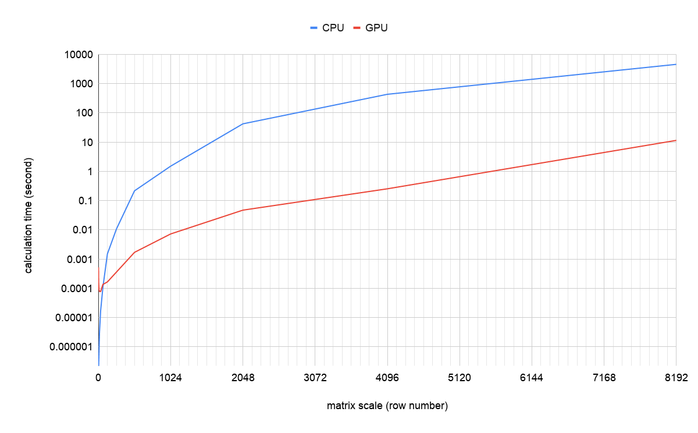

#  Project 4

Zhicheng Zhang - G45149856


### 1. Introduction

CUDA Matrix Multiplication - dot product of two square matrix.


### 2. Environment

- [Intel(R) Core(TM) i7-9700K @ 3.60 GHz](https://ark.intel.com/content/www/us/en/ark/products/186604/intel-core-i7-9700k-processor-12m-cache-up-to-4-90-ghz.html)
- [NVIDIA GeForce RTX 2080 Super](https://www.nvidia.com/en-us/geforce/graphics-cards/rtx-2080-super/)
- [Windows 10](https://www.microsoft.com/en-us/windows)
- [CUDA Toolkit 10.2](https://developer.nvidia.com/cuda-downloads)
- [Visual Studio 2019](https://visualstudio.microsoft.com/vs/)

<div style="page-break-after: always;"></div>

### 3. Implementation

#### **Data Structure of Matrix**

Class `Matrix` in file `matrix.h` defines the data structure of the matrix:

- `data` is pointed to a dynamic allocated memory space which can could store `total_data` / `size * size` integers.
- There are two constructor:
  - `Matrix(int size)` is used to allocate memory space and generate a `size * size` matrix by filling random integers in $[0, 100)$.
  - `Matrix(int size, int fill)` is used to allocate memory space generate a `size * size` matrix by filling `fill`.

```  C++
#pragma once

class Matrix
{
public:
  int *data;
  int size;
  int total_size;
  Matrix(int size);
  Matrix(int size, int fill);
  ~Matrix();
  void Show();
};
```

#### **Dot Product By CPU**

Function `DotProductByCpu` in file `cpu.cpp` uses 3-level for-loop to calculate dot product on CPU.

``` c++
#include <windows.h>
#include "matrix.h"
#include "timer.h"

void DotProductByCpu(Matrix *input_1, Matrix *input_2, Matrix *output)
{
  int size = output->size;
  int total_size = output->total_size;
  int row;
  int column;
  int result;
  for (int i = 0; i < total_size; i++)
  {
    row = i / size;
    column = i % size;
    result = 0;
    int temp = input_1->data[0];
    for (int j = 0; j < size; j++)
    {
      int x = input_1->data[row * size + j];
      int y = input_2->data[j * size + column];
      result += input_1->data[row * size + j] * input_2->data[j * size + column];
    }
    output->data[i] = result;
  }
}
```

#### **Dot Product By GPU**

Function `DotProductByGpu` in file `gpu.cu` indicate the way to calculate dot product By GPU.

``` c++
#include "cuda_runtime.h"
#include "device_launch_parameters.h"
#include "calculate.h"
#include "cuda_helper.h"
#include "matrix.h"

__global__ void KernelDotProduct(int *in_1, int *in_2, int size, int *out)
{
  int index = blockIdx.x * blockDim.x + threadIdx.x;
  int total_size = size * size;
  if (index >= total_size)
  {
    return;
  }
  int row = index / size;
  int column = index % size;
  int result = 0;
  for (int i = 0; i < size; i++)
  {
    result += in_1[row * size + i] * in_2[i * size + column];
  }
  out[index] = result;
}

void DotProductByGpu(Matrix *input_1, Matrix *input_2, Matrix *output)
{
  int size = output->size;
  int total_size = output->total_size;
  CudaErrorHandler(cudaSetDevice(0));
  // allocate
  int *in_1 = NULL;
  int *in_2 = NULL;
  int *out = NULL;
  CudaErrorHandler(cudaMalloc(&in_1, total_size * sizeof(int)));
  CudaErrorHandler(cudaMalloc(&in_2, total_size * sizeof(int)));
  CudaErrorHandler(cudaMalloc(&out, total_size * sizeof(int)));
  // host => device
  CudaErrorHandler(cudaMemcpy(in_1, input_1->data, total_size * sizeof(int), cudaMemcpyKind::cudaMemcpyHostToDevice));
  CudaErrorHandler(cudaMemcpy(in_2, input_2->data, total_size * sizeof(int), cudaMemcpyKind::cudaMemcpyHostToDevice));
  // Launch a kernel on the GPU with one thread for each element.
  KernelDotProduct<<<total_size / 1024 + 1, 1024>>>(in_1, in_2, size, out);
  // Check for any errors launching the kernel
  CudaErrorHandler(cudaGetLastError());
  // host <= device
  CudaErrorHandler(cudaMemcpy(output->data, out, total_size * sizeof(int), cudaMemcpyKind::cudaMemcpyDeviceToHost));
  // synchronize
  CudaErrorHandler(cudaDeviceSynchronize());
}
```

#### Main

Function `main` in file `main.cpp` does the following things:

1. List parameters of CUDA devices.
2. Calculate "16 x 16 matrix dot production, M = all one’s, N=all two’s" by using CPU and GPU. Show time and result after the calculation.
3. Calculate dot production of groups of two matrices whose shade are 1x1, 2x2, 4x4, 8x8, 16x16, 32x32, 64x64, 128x128, 256x256, 512x512, 1024x1024, 2048x2048, 4096x4096 and 8192x8192 by using CPU and GPU. Items of matrices are randomly generated. Show time and result (only for matrices whose shapes are not larger than 8x8) after the calculation.

#### Source Code

I have uploaded the source code to my GitHub account. Here is it:

https://github.com/zzc-tongji/gwu-csci-6461-computer-system-architecture/tree/master/project-4

<div style="page-break-after: always;"></div>

### 4. Result

```
----------------------------------------

CUDA device:                                       #0
ASCII string identifying device:                   GeForce RTX 2080 SUPER
Number of asynchronous engines:                    3
Clock frequency in kilohertz:                      1815000
Major and minor compute capability:                7.5
Maximum size of each dimension of a grid:          2147483647 / 65535 / 65535
Maximum size of each dimension of a block:         1024 / 1024 / 64
Maximum resident threads per multiprocessor:       1024
Maximum number of threads per block:               1024
Maximum pitch in bytes allowed by memory copies:   2147483647
Number of multiprocessors on device:               48
32-bit registers available per block:              65536
Shared memory available per block in bytes:        49152
Alignment requirement for textures:                512
Constant memory available on device in bytes:      65536
Global memory available on device in bytes:        8589934592
Warp size in threads (per SM):                     32

----------------------------------------

size = 16x16

[CPU]
Clock Rate (MHz): 9.000
Clock Count (tick)：29
Time (second): 0.000003

[GPU]
Clock Rate (MHz): 9.000
Clock Count (tick)：1369
Time (second): 0.000137

[m]
  1  1  1  1  1  1  1  1  1  1  1  1  1  1  1  1
  1  1  1  1  1  1  1  1  1  1  1  1  1  1  1  1
  1  1  1  1  1  1  1  1  1  1  1  1  1  1  1  1
  1  1  1  1  1  1  1  1  1  1  1  1  1  1  1  1
  1  1  1  1  1  1  1  1  1  1  1  1  1  1  1  1
  1  1  1  1  1  1  1  1  1  1  1  1  1  1  1  1
  1  1  1  1  1  1  1  1  1  1  1  1  1  1  1  1
  1  1  1  1  1  1  1  1  1  1  1  1  1  1  1  1
  1  1  1  1  1  1  1  1  1  1  1  1  1  1  1  1
  1  1  1  1  1  1  1  1  1  1  1  1  1  1  1  1
  1  1  1  1  1  1  1  1  1  1  1  1  1  1  1  1
  1  1  1  1  1  1  1  1  1  1  1  1  1  1  1  1
  1  1  1  1  1  1  1  1  1  1  1  1  1  1  1  1
  1  1  1  1  1  1  1  1  1  1  1  1  1  1  1  1
  1  1  1  1  1  1  1  1  1  1  1  1  1  1  1  1
  1  1  1  1  1  1  1  1  1  1  1  1  1  1  1  1

[n]
  2  2  2  2  2  2  2  2  2  2  2  2  2  2  2  2
  2  2  2  2  2  2  2  2  2  2  2  2  2  2  2  2
  2  2  2  2  2  2  2  2  2  2  2  2  2  2  2  2
  2  2  2  2  2  2  2  2  2  2  2  2  2  2  2  2
  2  2  2  2  2  2  2  2  2  2  2  2  2  2  2  2
  2  2  2  2  2  2  2  2  2  2  2  2  2  2  2  2
  2  2  2  2  2  2  2  2  2  2  2  2  2  2  2  2
  2  2  2  2  2  2  2  2  2  2  2  2  2  2  2  2
  2  2  2  2  2  2  2  2  2  2  2  2  2  2  2  2
  2  2  2  2  2  2  2  2  2  2  2  2  2  2  2  2
  2  2  2  2  2  2  2  2  2  2  2  2  2  2  2  2
  2  2  2  2  2  2  2  2  2  2  2  2  2  2  2  2
  2  2  2  2  2  2  2  2  2  2  2  2  2  2  2  2
  2  2  2  2  2  2  2  2  2  2  2  2  2  2  2  2
  2  2  2  2  2  2  2  2  2  2  2  2  2  2  2  2
  2  2  2  2  2  2  2  2  2  2  2  2  2  2  2  2

[r_cpu]
 32 32 32 32 32 32 32 32 32 32 32 32 32 32 32 32
 32 32 32 32 32 32 32 32 32 32 32 32 32 32 32 32
 32 32 32 32 32 32 32 32 32 32 32 32 32 32 32 32
 32 32 32 32 32 32 32 32 32 32 32 32 32 32 32 32
 32 32 32 32 32 32 32 32 32 32 32 32 32 32 32 32
 32 32 32 32 32 32 32 32 32 32 32 32 32 32 32 32
 32 32 32 32 32 32 32 32 32 32 32 32 32 32 32 32
 32 32 32 32 32 32 32 32 32 32 32 32 32 32 32 32
 32 32 32 32 32 32 32 32 32 32 32 32 32 32 32 32
 32 32 32 32 32 32 32 32 32 32 32 32 32 32 32 32
 32 32 32 32 32 32 32 32 32 32 32 32 32 32 32 32
 32 32 32 32 32 32 32 32 32 32 32 32 32 32 32 32
 32 32 32 32 32 32 32 32 32 32 32 32 32 32 32 32
 32 32 32 32 32 32 32 32 32 32 32 32 32 32 32 32
 32 32 32 32 32 32 32 32 32 32 32 32 32 32 32 32
 32 32 32 32 32 32 32 32 32 32 32 32 32 32 32 32

[r_gpu]
 32 32 32 32 32 32 32 32 32 32 32 32 32 32 32 32
 32 32 32 32 32 32 32 32 32 32 32 32 32 32 32 32
 32 32 32 32 32 32 32 32 32 32 32 32 32 32 32 32
 32 32 32 32 32 32 32 32 32 32 32 32 32 32 32 32
 32 32 32 32 32 32 32 32 32 32 32 32 32 32 32 32
 32 32 32 32 32 32 32 32 32 32 32 32 32 32 32 32
 32 32 32 32 32 32 32 32 32 32 32 32 32 32 32 32
 32 32 32 32 32 32 32 32 32 32 32 32 32 32 32 32
 32 32 32 32 32 32 32 32 32 32 32 32 32 32 32 32
 32 32 32 32 32 32 32 32 32 32 32 32 32 32 32 32
 32 32 32 32 32 32 32 32 32 32 32 32 32 32 32 32
 32 32 32 32 32 32 32 32 32 32 32 32 32 32 32 32
 32 32 32 32 32 32 32 32 32 32 32 32 32 32 32 32
 32 32 32 32 32 32 32 32 32 32 32 32 32 32 32 32
 32 32 32 32 32 32 32 32 32 32 32 32 32 32 32 32
 32 32 32 32 32 32 32 32 32 32 32 32 32 32 32 32

----------------------------------------

size = 1x1

[CPU]
Clock Rate (MHz): 9.000
Clock Count (tick)：0
Time (second): 0.000000

[GPU]
Clock Rate (MHz): 9.000
Clock Count (tick)：1477
Time (second): 0.000148

[m]
     56

[n]
     56

[r_cpu]
   3136

[r_gpu]
   3136

----------------------------------------

size = 2x2

[CPU]
Clock Rate (MHz): 9.000
Clock Count (tick)：0
Time (second): 0.000000

[GPU]
Clock Rate (MHz): 9.000
Clock Count (tick)：4725
Time (second): 0.000472

[m]
     56     38
     44      3

[n]
     56     38
     44      3

[r_cpu]
   4808   2242
   2596   1681

[r_gpu]
   4808   2242
   2596   1681

----------------------------------------

size = 4x4

[CPU]
Clock Rate (MHz): 9.000
Clock Count (tick)：2
Time (second): 0.000000

[GPU]
Clock Rate (MHz): 9.000
Clock Count (tick)：1490
Time (second): 0.000149

[m]
     56     38     44      3
     88     61     92     69
     80     51     23     93
     73     44     43     21

[n]
     56     38     44      3
     88     61     92     69
     80     51     23     93
     73     44     43     21

[r_cpu]
  10219   6822   7101   6945
  22693  14793  14567  14478
  17597  11416  12740   7851
  12933   8575   9152   7695

[r_gpu]
  10219   6822   7101   6945
  22693  14793  14567  14478
  17597  11416  12740   7851
  12933   8575   9152   7695

----------------------------------------

size = 8x8

[CPU]
Clock Rate (MHz): 9.000
Clock Count (tick)：5
Time (second): 0.000000

[GPU]
Clock Rate (MHz): 9.000
Clock Count (tick)：827
Time (second): 0.000083

[m]
     56     38     44      3     88     61     92     69
     80     51     23     93     73     44     43     21
     79     66     81     83     90     22     80      7
     46     33     49     12      1     92     97     68
     91     48     78     69      0     28      1     82
     53     94     91     42     96     42     42     11
     33      4     83     46     69     15     14     94
     46     64     34     94     99      1     13     23

[n]
     56     38     44      3     88     61     92     69
     80     51     23     93     73     44     43     21
     79     66     81     83     90     22     80      7
     46     33     49     12      1     92     97     68
     91     48     78     69      0     28      1     82
     53     94     91     42     96     42     42     11
     33      4     83     46     69     15     14     94
     46     64     34     94     99      1     13     23

[r_cpu]
  27241  21811  29446  26742  30700  12807  15432  23296
  26015  19384  25094  18845  22196  20744  23210  24071
  32239  21609  31522  25566  27468  21792  26862  28351
  20935  20497  26153  22205  33136  11855  16842  16802
  23561  21215  20226  20969  29476  17000  25625  14813
  32463  23628  29093  28312  27777  18328  22863  21659
  22701  19248  21626  22783  22424  11113  16427  15371
  25255  16728  20530  19673  15144  18050  19444  21028

[r_gpu]
  27241  21811  29446  26742  30700  12807  15432  23296
  26015  19384  25094  18845  22196  20744  23210  24071
  32239  21609  31522  25566  27468  21792  26862  28351
  20935  20497  26153  22205  33136  11855  16842  16802
  23561  21215  20226  20969  29476  17000  25625  14813
  32463  23628  29093  28312  27777  18328  22863  21659
  22701  19248  21626  22783  22424  11113  16427  15371
  25255  16728  20530  19673  15144  18050  19444  21028

----------------------------------------

size = 16x16

[CPU]
Clock Rate (MHz): 9.000
Clock Count (tick)：28
Time (second): 0.000003

[GPU]
Clock Rate (MHz): 9.000
Clock Count (tick)：707
Time (second): 0.000071

----------------------------------------

size = 32x32

[CPU]
Clock Rate (MHz): 9.000
Clock Count (tick)：155
Time (second): 0.000016

[GPU]
Clock Rate (MHz): 9.000
Clock Count (tick)：706
Time (second): 0.000071

----------------------------------------

size = 64x64

[CPU]
Clock Rate (MHz): 9.000
Clock Count (tick)：983
Time (second): 0.000098

[GPU]
Clock Rate (MHz): 9.000
Clock Count (tick)：1228
Time (second): 0.000123

----------------------------------------

size = 128x128

[CPU]
Clock Rate (MHz): 9.000
Clock Count (tick)：13668
Time (second): 0.001367

[GPU]
Clock Rate (MHz): 9.000
Clock Count (tick)：1500
Time (second): 0.000150

----------------------------------------

size = 256x256

[CPU]
Clock Rate (MHz): 9.000
Clock Count (tick)：96716
Time (second): 0.009672

[GPU]
Clock Rate (MHz): 9.000
Clock Count (tick)：3256
Time (second): 0.000326

----------------------------------------

size = 512x512

[CPU]
Clock Rate (MHz): 9.000
Clock Count (tick)：1954040
Time (second): 0.195404

[GPU]
Clock Rate (MHz): 9.000
Clock Count (tick)：15381
Time (second): 0.001538

----------------------------------------

size = 1024x1024

[CPU]
Clock Rate (MHz): 9.000
Clock Count (tick)：13599900
Time (second): 1.359990

[GPU]
Clock Rate (MHz): 9.000
Clock Count (tick)：65413
Time (second): 0.006541

----------------------------------------

size = 2048x2048

[CPU]
Clock Rate (MHz): 9.000
Clock Count (tick)：381469500
Time (second): 38.146950

[GPU]
Clock Rate (MHz): 9.000
Clock Count (tick)：426655
Time (second): 0.042666

----------------------------------------

size = 4096x4096

[CPU]
Clock Rate (MHz): 9.000
Clock Count (tick)：3906021319
Time (second): 390.602132

[GPU]
Clock Rate (MHz): 9.000
Clock Count (tick)：2290312
Time (second): 0.229031

----------------------------------------

size = 8192x8192

[CPU]
Clock Rate (MHz): 9.000
Clock Count (tick)：41306953655
Time (second): 4130.695365

[GPU]
Clock Rate (MHz): 9.000
Clock Count (tick)：103745836
Time (second): 10.374584

----------------------------------------
```

<div style="page-break-after: always;"></div>

### 5. Conclusion

The performance of matrix dot production is shown as the following chart. **Notice that the vertical axis is log scale.**



The chart shows that:

- When the matrix size is larger than 128x128, GPU spends less time than CPU.

- When the matrix size is larger than 1024x1024, the time spending of CPU is 2.5-3 orders of magnitude than which of GPU.
